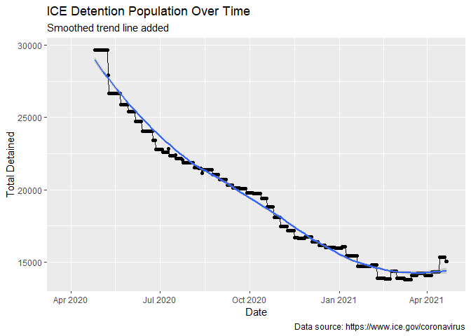
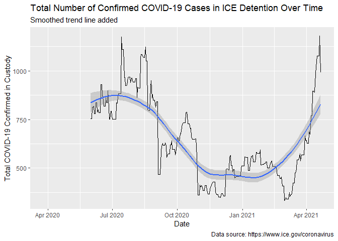
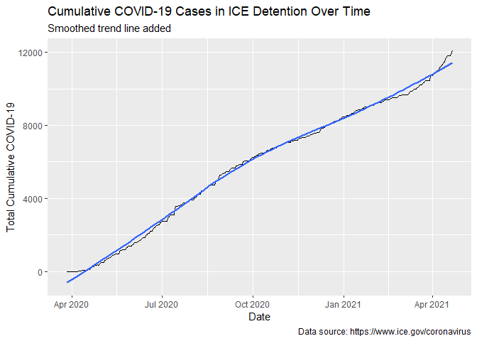
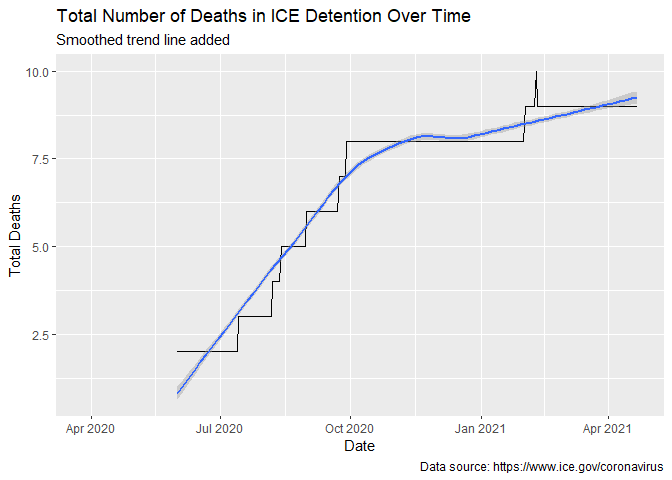

```r
library(readr)
library(summarytools)
```

```
## Registered S3 method overwritten by 'pryr':
##   method      from
##   print.bytes Rcpp
```

```r
st_options(plain.ascii = FALSE,
           footnote = NA,
           subtitle.emphasis = FALSE,
           round.digits = 2)
library(tidyverse)
```

```
## -- Attaching packages --------------------------------------- tidyverse 1.3.0 --
```

```
## v ggplot2 3.3.3     v dplyr   1.0.5
## v tibble  3.1.0     v stringr 1.4.0
## v tidyr   1.1.3     v forcats 0.5.1
## v purrr   0.3.4
```

```
## -- Conflicts ------------------------------------------ tidyverse_conflicts() --
## x dplyr::filter() masks stats::filter()
## x dplyr::lag()    masks stats::lag()
## x tibble::view()  masks summarytools::view()
```

```r
library(lubridate)
```

```
## 
## Attaching package: 'lubridate'
```

```
## The following objects are masked from 'package:base':
## 
##     date, intersect, setdiff, union
```

```r
library(ggplot2)
library(ggstatsplot)
```

```
## Registered S3 method overwritten by 'parameters':
##   method     from      
##   ci.blavaan bayestestR
```

```
## In case you would like cite this package, cite it as:
##      Patil, I. (2018). ggstatsplot: "ggplot2" Based Plots with Statistical Details. CRAN.
##      Retrieved from https://cran.r-project.org/web/packages/ggstatsplot/index.html
```

```r
library(knitr)
options(digits=3)
opts_chunk$set(results = 'asis',
               comment = NA,
               prompt = FALSE,
               cache = FALSE)
# Turn off scientific notation
options(digits=5, scipen=15) 
```


```r
# Load Dataset
df_summary <- read_csv("data/covid_summaries.csv", 
    col_types = cols(Date = col_date(format = "%m/%d/%Y"), 
        `Total Deaths` = col_double(), `Total COVID-19 Confirmed in Custody` = col_double()))
View(df_summary)
```


```r
ggplot(df_summary, aes(x=Date, y=`Total Detained`))+
  geom_line()+
  geom_point()+
  geom_smooth()+
  labs(
    title = "ICE Detention Population Over Time",
    subtitle = "Smoothed trend line added",
    caption = "Data source: https://www.ice.gov/coronavirus"
  )
```

```
`geom_smooth()` using method = 'loess' and formula 'y ~ x'
```

```
Warning: Removed 27 rows containing non-finite values (stat_smooth).
```

```
Warning: Removed 27 row(s) containing missing values (geom_path).
```

```
Warning: Removed 27 rows containing missing values (geom_point).
```

<!-- -->


```r
ggplot(df_summary, aes(x=Date, y=`Total COVID-19 Confirmed in Custody`))+
  geom_line()+
  geom_smooth()+
   labs(
    title = "Total Number of Confirmed COVID-19 Cases in ICE Detention Over Time",
    subtitle = "Smoothed trend line added",
    caption = "Data source: https://www.ice.gov/coronavirus"
  )
```

```
`geom_smooth()` using method = 'loess' and formula 'y ~ x'
```

```
Warning: Removed 63 rows containing non-finite values (stat_smooth).
```

```
Warning: Removed 63 row(s) containing missing values (geom_path).
```

<!-- -->


```r
df_summary %>% 
  mutate(`Confirmed Detained Ratio` = `Total COVID-19 Confirmed in Custody`/`Total Detained`) %>%
  ggplot(aes(x=Date, y=`Confirmed Detained Ratio`))+

  geom_line()+
  geom_smooth()+
   labs(
    title = "Ratio of Confirmed COVID-19 Cases in ICE Detention by \nTotal ICE Detention Population Over Time",
    subtitle = "Smoothed trend line added",
    caption = "Data source: https://www.ice.gov/coronavirus"
  )
```

```
`geom_smooth()` using method = 'loess' and formula 'y ~ x'
```

```
Warning: Removed 63 rows containing non-finite values (stat_smooth).
```

```
Warning: Removed 63 row(s) containing missing values (geom_path).
```

<!-- -->


```r
ggplot(df_summary, aes(x=Date, y=`Total Cumulative COVID-19`))+
  geom_line()+
  geom_smooth()+
   labs(
    title = "Cumulative COVID-19 Cases in ICE Detention Over Time",
    subtitle = "Smoothed trend line added",
    caption = "Data source: https://www.ice.gov/coronavirus"
  )
```

```
`geom_smooth()` using method = 'loess' and formula 'y ~ x'
```

<!-- -->


```r
ggplot(df_summary, aes(x=Date, y=`Total Tested`))+
  geom_line()+
  geom_smooth()+
   labs(
    title = "Total Number of COVID-19 Tests in ICE Detention Population Over Time",
    subtitle = "Smoothed trend line added",
    caption = "Data source: https://www.ice.gov/coronavirus"
  )
```

```
`geom_smooth()` using method = 'loess' and formula 'y ~ x'
```

```
Warning: Removed 31 rows containing non-finite values (stat_smooth).
```

```
Warning: Removed 31 row(s) containing missing values (geom_path).
```

<!-- -->


```r
ggplot(df_summary, aes(x=Date, y=`Total Deaths`))+
  geom_line()+
  geom_smooth()+
   labs(
    title = "Total Number of Deaths in ICE Detention Over Time",
    subtitle = "Smoothed trend line added",
    caption = "Data source: https://www.ice.gov/coronavirus"
  )
```

```
`geom_smooth()` using method = 'loess' and formula 'y ~ x'
```

```
Warning: Removed 63 rows containing non-finite values (stat_smooth).
```

```
Warning: Removed 63 row(s) containing missing values (geom_path).
```

<!-- -->


