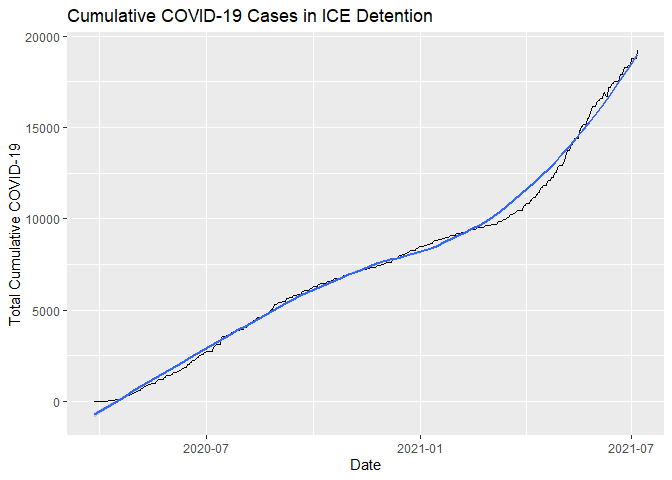
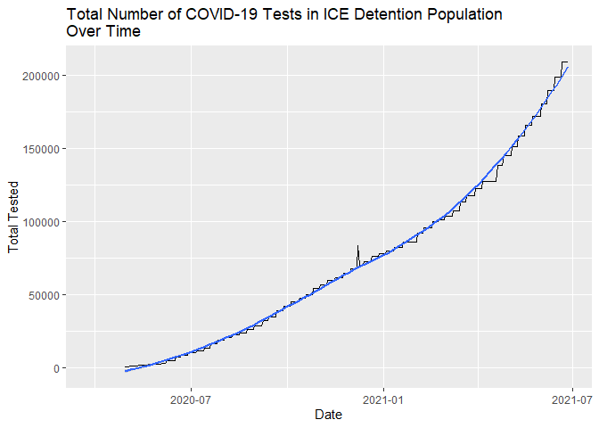
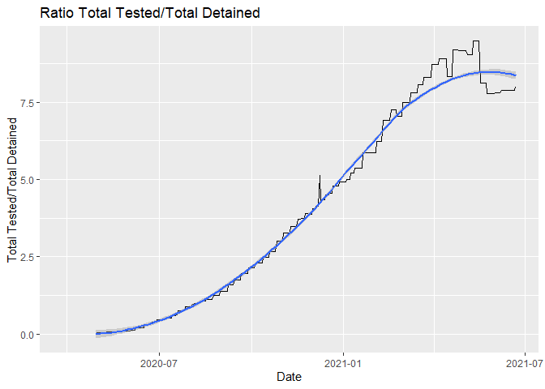
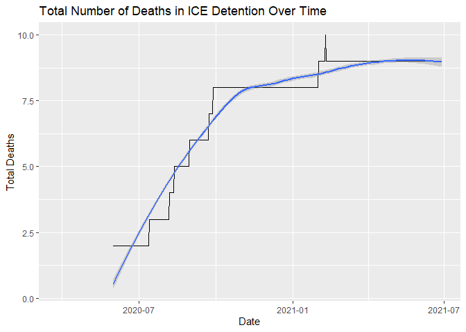

## Notice: This page is no longer regularly updated; daily updated graphs are now [located here](https://ncraig.netlify.app/posts/2021-06-30-current-ice-detention-population/).

****

# Introduction

The following document provides plots of data reported on the Immigration and Customs Enforcement [Guidance on COVID-19](https://www.ice.gov/coronavirus) website. On Friday March 13, 2020 ICE suspended family and social visitation. On March 27, 2020 ICE [established](https://web.archive.org/web/20200327175825/https://www.ice.gov/coronavirus) the Guidance on COVID-19 web page and indicated the site would be updated frequently. Shortly afterwards I began logging the data on a daily basis, occasionally relying on the Internet Archive's Wayback Machine's [regular scrapes](https://web.archive.org/web/20200401000000*/https://www.ice.gov/coronavirus) of the page to pick up days that I missed.

Results of those scrapes are contained in a [github](https://github.com/n8craig/ICE-COVID-19) repository, and additional details reported on my [website.](https://ncraig.netlify.app/)


```{=html}
<div id="htmlwidget-576a3884b0a46e670ce5" style="width:672px;height:480px;" class="plotly html-widget"></div>
<script type="application/json" data-for="htmlwidget-576a3884b0a46e670ce5">{"x":{"data":[{"x":[18348,18349,18350,18351,18352,18353,18354,18356,18358,18359,18360,18361,18362,18363,18364,18365,18366,18367,18368,18369,18370,18371,18372,18373,18374,18375,18376,18377,18378,18379,18380,18381,18382,18383,18384,18385,18386,18387,18388,18389,18390,18391,18392,18393,18395,18396,18397,18398,18399,18400,18401,18402,18403,18404,18405,18406,18407,18408,18409,18410,18411,18412,18413,18414,18415,18416,18417,18418,18419,18420,18421,18422,18423,18424,18425,18426,18427,18428,18429,18430,18431,18432,18433,18434,18435,18436,18437,18438,18439,18440,18441,18442,18443,18444,18445,18446,18447,18448,18449,18450,18451,18452,18453,18454,18455,18456,18457,18458,18459,18460,18461,18462,18463,18464,18465,18466,18467,18468,18469,18470,18471,18472,18473,18474,18475,18476,18477,18478,18479,18480,18481,18482,18483,18484,18485,18486,18487,18488,18489,18490,18491,18492,18493,18494,18495,18496,18497,18498,18499,18500,18501,18502,18503,18504,18505,18507,18508,18509,18510,18511,18512,18513,18514,18515,18516,18517,18518,18519,18520,18521,18522,18523,18524,18525,18526,18527,18528,18529,18530,18531,18532,18533,18534,18535,18536,18537,18538,18539,18540,18541,18542,18543,18544,18545,18546,18547,18548,18549,18550,18551,18552,18553,18554,18555,18556,18557,18558,18560,18561,18562,18563,18564,18565,18566,18567,18568,18569,18570,18571,18572,18573,18574,18575,18576,18577,18578,18579,18580,18581,18582,18583,18584,18585,18586,18587,18588,18589,18590,18591,18592,18593,18594,18595,18596,18597,18598,18599,18600,18601,18602,18603,18604,18605,18606,18607,18608,18609,18610,18611,18612,18613,18614,18615,18616,18617,18618,18619,18620,18621,18622,18623,18624,18625,18626,18627,18628,18629,18630,18631,18632,18633,18634,18635,18636,18637,18638,18639,18640,18641,18642,18643,18644,18645,18646,18647,18648,18649,18650,18651,18652,18653,18654,18655,18656,18657,18658,18659,18660,18661,18662,18663,18664,18665,18666,18667,18668,18669,18670,18671,18672,18673,18674,18675,18676,18677,18678,18679,18680,18681,18682,18683,18684,18685,18686,18687,18688,18689,18690,18691,18692,18693,18694,18695,18696,18697,18698,18699,18700,18701,18702,18703,18704,18705,18706,18707,18708,18709,18710,18711,18712,18713,18714,18715,18716,18717,18718,18719,18720,18721,18722,18723,18724,18725,18726,18727,18728,18729,18730,18731,18732,18733,18734,18735,18736,18737,18738,18739,18740,18741,18742,18743,18744,18745,18746,18747,18748,18749,18750,18751,18752,18753,18754,18755,18756,18757,18758,18759,18760,18761,18762,18763,18764,18765,18766,18767,18768,18769,18770,18771,18772,18773,18774,18775,18776,18777,18778,18779,18780,18781,18782,18783,18784,18785,18786,18787,18788,18789,18790,18791,18792,18793,18794,18795,18796,18797,18798,18799,18800,18801,18802,18803,18804,18805,18806,18807,18808,18809,18810,18811,18812,18813,18814],"y":[null,null,null,null,null,null,null,null,null,null,null,null,null,null,null,null,null,null,null,null,null,null,null,null,null,null,null,29675,29675,29675,29675,29675,29675,29675,29675,29675,29675,29675,29675,29675,29675,27908,26660,26660,26660,26660,26660,26660,26660,26660,26660,26660,26660,25911,25911,25911,25911,25911,25911,25911,25911,25421,25421,25421,25421,25421,25421,25421,24713,24713,24713,24713,24713,24713,24713,24041,24041,24041,24041,24041,24041,24041,24041,24041,24041,24041,23429,23429,23429,22805,22805,22805,22805,22805,22805,22805,22579,22579,22579,22579,22579,22579,22835,22340,22340,22340,22340,22340,22340,22405,22142,22142,22142,22142,22142,22142,22067,21884,21884,21884,21884,21884,21884,21888,21888,21888,21888,21888,21546,21546,21546,21546,21546,21494,21494,21494,21118,21402,21402,21402,21402,21402,21402,21402,21402,21402,21402,21066,21066,21066,21066,21066,21066,21066,20713,20713,20713,20713,20713,20713,20713,20302,20302,20302,20302,20302,20302,20138,20138,20138,20138,20138,20138,20138,20097,20097,20097,20097,20097,20097,20097,19791,19791,19791,19791,19791,19791,19791,19742,19742,19742,19742,19742,19742,19742,19742,19372,19372,19372,19372,19372,19372,18827,18827,18827,18827,18827,18827,18099,18099,18099,18099,18099,18099,18099,17458,17458,17458,17458,17458,17458,17458,17163,17163,17163,17163,17163,17163,17163,16693,16693,16693,16693,16614,16614,16614,16614,16614,16614,16614,16709,16709,16709,16709,16709,16709,16709,16377,16377,16377,16377,16377,16377,16377,16163,16163,16163,16163,16163,16163,16163,15993,15993,15993,15993,15993,15993,15993,15993,15993,15993,15943,15943,15943,15943,15943,15943,15943,16037,16037,16037,16037,15415,15415,15415,15415,15415,15415,15415,15415,15415,15415,15415,15415,14715,14715,14715,14715,14715,14715,14715,14715,14715,14715,14715,14715,14715,14715,14775,14775,14775,14775,14775,14775,13860,13860,13860,13860,13860,13860,13860,13860,13832,13832,13832,13832,13832,13832,14347,14347,14347,14347,14347,14347,13890,13890,13890,13890,13890,13890,13890,13890,13764,13764,13764,13764,13764,13764,13764,14051,14051,14051,14051,14051,14051,14216,14216,14216,14216,14216,14216,14216,14216,14077,14077,14077,14077,14077,14077,14077,14315,14315,14315,14315,14315,14315,14315,14315,15344,15344,15344,15344,15344,15344,15054,15054,15054,15054,15054,15054,15830,15830,15830,15830,15830,15830,15830,15830,16721,16721,16721,16721,16721,16721,16721,16721,16721,16721,16721,16721,16721,20430,20430,20430,20430,20430,20430,20430,22140,22140,22140,22140,22140,22140,22140,22140,23107,23107,23107,23107,23107,23107,24100,24100,24100,24100,24100,24100,24100,25238,25238,25238,25238,25238,25238,25238,26197,26197,26197,26197,26197,26197,26197,26789,26789,26789,26789,26789,26789,26789,26789,27008],"text":["date: 2020-03-27<br />total_detained:    NA","date: 2020-03-28<br />total_detained:    NA","date: 2020-03-29<br />total_detained:    NA","date: 2020-03-30<br />total_detained:    NA","date: 2020-03-31<br />total_detained:    NA","date: 2020-04-01<br />total_detained:    NA","date: 2020-04-02<br />total_detained:    NA","date: 2020-04-04<br />total_detained:    NA","date: 2020-04-06<br />total_detained:    NA","date: 2020-04-07<br />total_detained:    NA","date: 2020-04-08<br />total_detained:    NA","date: 2020-04-09<br />total_detained:    NA","date: 2020-04-10<br />total_detained:    NA","date: 2020-04-11<br />total_detained:    NA","date: 2020-04-12<br />total_detained:    NA","date: 2020-04-13<br />total_detained:    NA","date: 2020-04-14<br />total_detained:    NA","date: 2020-04-15<br />total_detained:    NA","date: 2020-04-16<br />total_detained:    NA","date: 2020-04-17<br />total_detained:    NA","date: 2020-04-18<br />total_detained:    NA","date: 2020-04-19<br />total_detained:    NA","date: 2020-04-20<br />total_detained:    NA","date: 2020-04-21<br />total_detained:    NA","date: 2020-04-22<br />total_detained:    NA","date: 2020-04-23<br />total_detained:    NA","date: 2020-04-24<br />total_detained:    NA","date: 2020-04-25<br />total_detained: 29675","date: 2020-04-26<br />total_detained: 29675","date: 2020-04-27<br />total_detained: 29675","date: 2020-04-28<br />total_detained: 29675","date: 2020-04-29<br />total_detained: 29675","date: 2020-04-30<br />total_detained: 29675","date: 2020-05-01<br />total_detained: 29675","date: 2020-05-02<br />total_detained: 29675","date: 2020-05-03<br />total_detained: 29675","date: 2020-05-04<br />total_detained: 29675","date: 2020-05-05<br />total_detained: 29675","date: 2020-05-06<br />total_detained: 29675","date: 2020-05-07<br />total_detained: 29675","date: 2020-05-08<br />total_detained: 29675","date: 2020-05-09<br />total_detained: 27908","date: 2020-05-10<br />total_detained: 26660","date: 2020-05-11<br />total_detained: 26660","date: 2020-05-13<br />total_detained: 26660","date: 2020-05-14<br />total_detained: 26660","date: 2020-05-15<br />total_detained: 26660","date: 2020-05-16<br />total_detained: 26660","date: 2020-05-17<br />total_detained: 26660","date: 2020-05-18<br />total_detained: 26660","date: 2020-05-19<br />total_detained: 26660","date: 2020-05-20<br />total_detained: 26660","date: 2020-05-21<br />total_detained: 26660","date: 2020-05-22<br />total_detained: 25911","date: 2020-05-23<br />total_detained: 25911","date: 2020-05-24<br />total_detained: 25911","date: 2020-05-25<br />total_detained: 25911","date: 2020-05-26<br />total_detained: 25911","date: 2020-05-27<br />total_detained: 25911","date: 2020-05-28<br />total_detained: 25911","date: 2020-05-29<br />total_detained: 25911","date: 2020-05-30<br />total_detained: 25421","date: 2020-05-31<br />total_detained: 25421","date: 2020-06-01<br />total_detained: 25421","date: 2020-06-02<br />total_detained: 25421","date: 2020-06-03<br />total_detained: 25421","date: 2020-06-04<br />total_detained: 25421","date: 2020-06-05<br />total_detained: 25421","date: 2020-06-06<br />total_detained: 24713","date: 2020-06-07<br />total_detained: 24713","date: 2020-06-08<br />total_detained: 24713","date: 2020-06-09<br />total_detained: 24713","date: 2020-06-10<br />total_detained: 24713","date: 2020-06-11<br />total_detained: 24713","date: 2020-06-12<br />total_detained: 24713","date: 2020-06-13<br />total_detained: 24041","date: 2020-06-14<br />total_detained: 24041","date: 2020-06-15<br />total_detained: 24041","date: 2020-06-16<br />total_detained: 24041","date: 2020-06-17<br />total_detained: 24041","date: 2020-06-18<br />total_detained: 24041","date: 2020-06-19<br />total_detained: 24041","date: 2020-06-20<br />total_detained: 24041","date: 2020-06-21<br />total_detained: 24041","date: 2020-06-22<br />total_detained: 24041","date: 2020-06-23<br />total_detained: 24041","date: 2020-06-24<br />total_detained: 23429","date: 2020-06-25<br />total_detained: 23429","date: 2020-06-26<br />total_detained: 23429","date: 2020-06-27<br />total_detained: 22805","date: 2020-06-28<br />total_detained: 22805","date: 2020-06-29<br />total_detained: 22805","date: 2020-06-30<br />total_detained: 22805","date: 2020-07-01<br />total_detained: 22805","date: 2020-07-02<br />total_detained: 22805","date: 2020-07-03<br />total_detained: 22805","date: 2020-07-04<br />total_detained: 22579","date: 2020-07-05<br />total_detained: 22579","date: 2020-07-06<br />total_detained: 22579","date: 2020-07-07<br />total_detained: 22579","date: 2020-07-08<br />total_detained: 22579","date: 2020-07-09<br />total_detained: 22579","date: 2020-07-10<br />total_detained: 22835","date: 2020-07-11<br />total_detained: 22340","date: 2020-07-12<br />total_detained: 22340","date: 2020-07-13<br />total_detained: 22340","date: 2020-07-14<br />total_detained: 22340","date: 2020-07-15<br />total_detained: 22340","date: 2020-07-16<br />total_detained: 22340","date: 2020-07-17<br />total_detained: 22405","date: 2020-07-18<br />total_detained: 22142","date: 2020-07-19<br />total_detained: 22142","date: 2020-07-20<br />total_detained: 22142","date: 2020-07-21<br />total_detained: 22142","date: 2020-07-22<br />total_detained: 22142","date: 2020-07-23<br />total_detained: 22142","date: 2020-07-24<br />total_detained: 22067","date: 2020-07-25<br />total_detained: 21884","date: 2020-07-26<br />total_detained: 21884","date: 2020-07-27<br />total_detained: 21884","date: 2020-07-28<br />total_detained: 21884","date: 2020-07-29<br />total_detained: 21884","date: 2020-07-30<br />total_detained: 21884","date: 2020-07-31<br />total_detained: 21888","date: 2020-08-01<br />total_detained: 21888","date: 2020-08-02<br />total_detained: 21888","date: 2020-08-03<br />total_detained: 21888","date: 2020-08-04<br />total_detained: 21888","date: 2020-08-05<br />total_detained: 21546","date: 2020-08-06<br />total_detained: 21546","date: 2020-08-07<br />total_detained: 21546","date: 2020-08-08<br />total_detained: 21546","date: 2020-08-09<br />total_detained: 21546","date: 2020-08-10<br />total_detained: 21494","date: 2020-08-11<br />total_detained: 21494","date: 2020-08-12<br />total_detained: 21494","date: 2020-08-13<br />total_detained: 21118","date: 2020-08-14<br />total_detained: 21402","date: 2020-08-15<br />total_detained: 21402","date: 2020-08-16<br />total_detained: 21402","date: 2020-08-17<br />total_detained: 21402","date: 2020-08-18<br />total_detained: 21402","date: 2020-08-19<br />total_detained: 21402","date: 2020-08-20<br />total_detained: 21402","date: 2020-08-21<br />total_detained: 21402","date: 2020-08-22<br />total_detained: 21402","date: 2020-08-23<br />total_detained: 21402","date: 2020-08-24<br />total_detained: 21066","date: 2020-08-25<br />total_detained: 21066","date: 2020-08-26<br />total_detained: 21066","date: 2020-08-27<br />total_detained: 21066","date: 2020-08-28<br />total_detained: 21066","date: 2020-08-29<br />total_detained: 21066","date: 2020-08-30<br />total_detained: 21066","date: 2020-08-31<br />total_detained: 20713","date: 2020-09-02<br />total_detained: 20713","date: 2020-09-03<br />total_detained: 20713","date: 2020-09-04<br />total_detained: 20713","date: 2020-09-05<br />total_detained: 20713","date: 2020-09-06<br />total_detained: 20713","date: 2020-09-07<br />total_detained: 20713","date: 2020-09-08<br />total_detained: 20302","date: 2020-09-09<br />total_detained: 20302","date: 2020-09-10<br />total_detained: 20302","date: 2020-09-11<br />total_detained: 20302","date: 2020-09-12<br />total_detained: 20302","date: 2020-09-13<br />total_detained: 20302","date: 2020-09-14<br />total_detained: 20138","date: 2020-09-15<br />total_detained: 20138","date: 2020-09-16<br />total_detained: 20138","date: 2020-09-17<br />total_detained: 20138","date: 2020-09-18<br />total_detained: 20138","date: 2020-09-19<br />total_detained: 20138","date: 2020-09-20<br />total_detained: 20138","date: 2020-09-21<br />total_detained: 20097","date: 2020-09-22<br />total_detained: 20097","date: 2020-09-23<br />total_detained: 20097","date: 2020-09-24<br />total_detained: 20097","date: 2020-09-25<br />total_detained: 20097","date: 2020-09-26<br />total_detained: 20097","date: 2020-09-27<br />total_detained: 20097","date: 2020-09-28<br />total_detained: 19791","date: 2020-09-29<br />total_detained: 19791","date: 2020-09-30<br />total_detained: 19791","date: 2020-10-01<br />total_detained: 19791","date: 2020-10-02<br />total_detained: 19791","date: 2020-10-03<br />total_detained: 19791","date: 2020-10-04<br />total_detained: 19791","date: 2020-10-05<br />total_detained: 19742","date: 2020-10-06<br />total_detained: 19742","date: 2020-10-07<br />total_detained: 19742","date: 2020-10-08<br />total_detained: 19742","date: 2020-10-09<br />total_detained: 19742","date: 2020-10-10<br />total_detained: 19742","date: 2020-10-11<br />total_detained: 19742","date: 2020-10-12<br />total_detained: 19742","date: 2020-10-13<br />total_detained: 19372","date: 2020-10-14<br />total_detained: 19372","date: 2020-10-15<br />total_detained: 19372","date: 2020-10-16<br />total_detained: 19372","date: 2020-10-17<br />total_detained: 19372","date: 2020-10-18<br />total_detained: 19372","date: 2020-10-19<br />total_detained: 18827","date: 2020-10-20<br />total_detained: 18827","date: 2020-10-21<br />total_detained: 18827","date: 2020-10-22<br />total_detained: 18827","date: 2020-10-23<br />total_detained: 18827","date: 2020-10-25<br />total_detained: 18827","date: 2020-10-26<br />total_detained: 18099","date: 2020-10-27<br />total_detained: 18099","date: 2020-10-28<br />total_detained: 18099","date: 2020-10-29<br />total_detained: 18099","date: 2020-10-30<br />total_detained: 18099","date: 2020-10-31<br />total_detained: 18099","date: 2020-11-01<br />total_detained: 18099","date: 2020-11-02<br />total_detained: 17458","date: 2020-11-03<br />total_detained: 17458","date: 2020-11-04<br />total_detained: 17458","date: 2020-11-05<br />total_detained: 17458","date: 2020-11-06<br />total_detained: 17458","date: 2020-11-07<br />total_detained: 17458","date: 2020-11-08<br />total_detained: 17458","date: 2020-11-09<br />total_detained: 17163","date: 2020-11-10<br />total_detained: 17163","date: 2020-11-11<br />total_detained: 17163","date: 2020-11-12<br />total_detained: 17163","date: 2020-11-13<br />total_detained: 17163","date: 2020-11-14<br />total_detained: 17163","date: 2020-11-15<br />total_detained: 17163","date: 2020-11-16<br />total_detained: 16693","date: 2020-11-17<br />total_detained: 16693","date: 2020-11-18<br />total_detained: 16693","date: 2020-11-19<br />total_detained: 16693","date: 2020-11-20<br />total_detained: 16614","date: 2020-11-21<br />total_detained: 16614","date: 2020-11-22<br />total_detained: 16614","date: 2020-11-23<br />total_detained: 16614","date: 2020-11-24<br />total_detained: 16614","date: 2020-11-25<br />total_detained: 16614","date: 2020-11-26<br />total_detained: 16614","date: 2020-11-27<br />total_detained: 16709","date: 2020-11-28<br />total_detained: 16709","date: 2020-11-29<br />total_detained: 16709","date: 2020-11-30<br />total_detained: 16709","date: 2020-12-01<br />total_detained: 16709","date: 2020-12-02<br />total_detained: 16709","date: 2020-12-03<br />total_detained: 16709","date: 2020-12-04<br />total_detained: 16377","date: 2020-12-05<br />total_detained: 16377","date: 2020-12-06<br />total_detained: 16377","date: 2020-12-07<br />total_detained: 16377","date: 2020-12-08<br />total_detained: 16377","date: 2020-12-09<br />total_detained: 16377","date: 2020-12-10<br />total_detained: 16377","date: 2020-12-11<br />total_detained: 16163","date: 2020-12-12<br />total_detained: 16163","date: 2020-12-13<br />total_detained: 16163","date: 2020-12-14<br />total_detained: 16163","date: 2020-12-15<br />total_detained: 16163","date: 2020-12-16<br />total_detained: 16163","date: 2020-12-17<br />total_detained: 16163","date: 2020-12-18<br />total_detained: 15993","date: 2020-12-19<br />total_detained: 15993","date: 2020-12-20<br />total_detained: 15993","date: 2020-12-21<br />total_detained: 15993","date: 2020-12-22<br />total_detained: 15993","date: 2020-12-23<br />total_detained: 15993","date: 2020-12-24<br />total_detained: 15993","date: 2020-12-25<br />total_detained: 15993","date: 2020-12-26<br />total_detained: 15993","date: 2020-12-27<br />total_detained: 15993","date: 2020-12-28<br />total_detained: 15943","date: 2020-12-29<br />total_detained: 15943","date: 2020-12-30<br />total_detained: 15943","date: 2020-12-31<br />total_detained: 15943","date: 2021-01-01<br />total_detained: 15943","date: 2021-01-02<br />total_detained: 15943","date: 2021-01-03<br />total_detained: 15943","date: 2021-01-04<br />total_detained: 16037","date: 2021-01-05<br />total_detained: 16037","date: 2021-01-06<br />total_detained: 16037","date: 2021-01-07<br />total_detained: 16037","date: 2021-01-08<br />total_detained: 15415","date: 2021-01-09<br />total_detained: 15415","date: 2021-01-10<br />total_detained: 15415","date: 2021-01-11<br />total_detained: 15415","date: 2021-01-12<br />total_detained: 15415","date: 2021-01-13<br />total_detained: 15415","date: 2021-01-14<br />total_detained: 15415","date: 2021-01-15<br />total_detained: 15415","date: 2021-01-16<br />total_detained: 15415","date: 2021-01-17<br />total_detained: 15415","date: 2021-01-18<br />total_detained: 15415","date: 2021-01-19<br />total_detained: 15415","date: 2021-01-20<br />total_detained: 14715","date: 2021-01-21<br />total_detained: 14715","date: 2021-01-22<br />total_detained: 14715","date: 2021-01-23<br />total_detained: 14715","date: 2021-01-24<br />total_detained: 14715","date: 2021-01-25<br />total_detained: 14715","date: 2021-01-26<br />total_detained: 14715","date: 2021-01-27<br />total_detained: 14715","date: 2021-01-28<br />total_detained: 14715","date: 2021-01-29<br />total_detained: 14715","date: 2021-01-30<br />total_detained: 14715","date: 2021-01-31<br />total_detained: 14715","date: 2021-02-01<br />total_detained: 14715","date: 2021-02-02<br />total_detained: 14715","date: 2021-02-03<br />total_detained: 14775","date: 2021-02-04<br />total_detained: 14775","date: 2021-02-05<br />total_detained: 14775","date: 2021-02-06<br />total_detained: 14775","date: 2021-02-07<br />total_detained: 14775","date: 2021-02-08<br />total_detained: 14775","date: 2021-02-09<br />total_detained: 13860","date: 2021-02-10<br />total_detained: 13860","date: 2021-02-11<br />total_detained: 13860","date: 2021-02-12<br />total_detained: 13860","date: 2021-02-13<br />total_detained: 13860","date: 2021-02-14<br />total_detained: 13860","date: 2021-02-15<br />total_detained: 13860","date: 2021-02-16<br />total_detained: 13860","date: 2021-02-17<br />total_detained: 13832","date: 2021-02-18<br />total_detained: 13832","date: 2021-02-19<br />total_detained: 13832","date: 2021-02-20<br />total_detained: 13832","date: 2021-02-21<br />total_detained: 13832","date: 2021-02-22<br />total_detained: 13832","date: 2021-02-23<br />total_detained: 14347","date: 2021-02-24<br />total_detained: 14347","date: 2021-02-25<br />total_detained: 14347","date: 2021-02-26<br />total_detained: 14347","date: 2021-02-27<br />total_detained: 14347","date: 2021-02-28<br />total_detained: 14347","date: 2021-03-01<br />total_detained: 13890","date: 2021-03-02<br />total_detained: 13890","date: 2021-03-03<br />total_detained: 13890","date: 2021-03-04<br />total_detained: 13890","date: 2021-03-05<br />total_detained: 13890","date: 2021-03-06<br />total_detained: 13890","date: 2021-03-07<br />total_detained: 13890","date: 2021-03-08<br />total_detained: 13890","date: 2021-03-09<br />total_detained: 13764","date: 2021-03-10<br />total_detained: 13764","date: 2021-03-11<br />total_detained: 13764","date: 2021-03-12<br />total_detained: 13764","date: 2021-03-13<br />total_detained: 13764","date: 2021-03-14<br />total_detained: 13764","date: 2021-03-15<br />total_detained: 13764","date: 2021-03-16<br />total_detained: 14051","date: 2021-03-17<br />total_detained: 14051","date: 2021-03-18<br />total_detained: 14051","date: 2021-03-19<br />total_detained: 14051","date: 2021-03-20<br />total_detained: 14051","date: 2021-03-21<br />total_detained: 14051","date: 2021-03-22<br />total_detained: 14216","date: 2021-03-23<br />total_detained: 14216","date: 2021-03-24<br />total_detained: 14216","date: 2021-03-25<br />total_detained: 14216","date: 2021-03-26<br />total_detained: 14216","date: 2021-03-27<br />total_detained: 14216","date: 2021-03-28<br />total_detained: 14216","date: 2021-03-29<br />total_detained: 14216","date: 2021-03-30<br />total_detained: 14077","date: 2021-03-31<br />total_detained: 14077","date: 2021-04-01<br />total_detained: 14077","date: 2021-04-02<br />total_detained: 14077","date: 2021-04-03<br />total_detained: 14077","date: 2021-04-04<br />total_detained: 14077","date: 2021-04-05<br />total_detained: 14077","date: 2021-04-06<br />total_detained: 14315","date: 2021-04-07<br />total_detained: 14315","date: 2021-04-08<br />total_detained: 14315","date: 2021-04-09<br />total_detained: 14315","date: 2021-04-10<br />total_detained: 14315","date: 2021-04-11<br />total_detained: 14315","date: 2021-04-12<br />total_detained: 14315","date: 2021-04-13<br />total_detained: 14315","date: 2021-04-14<br />total_detained: 15344","date: 2021-04-15<br />total_detained: 15344","date: 2021-04-16<br />total_detained: 15344","date: 2021-04-17<br />total_detained: 15344","date: 2021-04-18<br />total_detained: 15344","date: 2021-04-19<br />total_detained: 15344","date: 2021-04-20<br />total_detained: 15054","date: 2021-04-21<br />total_detained: 15054","date: 2021-04-22<br />total_detained: 15054","date: 2021-04-23<br />total_detained: 15054","date: 2021-04-24<br />total_detained: 15054","date: 2021-04-25<br />total_detained: 15054","date: 2021-04-26<br />total_detained: 15830","date: 2021-04-27<br />total_detained: 15830","date: 2021-04-28<br />total_detained: 15830","date: 2021-04-29<br />total_detained: 15830","date: 2021-04-30<br />total_detained: 15830","date: 2021-05-01<br />total_detained: 15830","date: 2021-05-02<br />total_detained: 15830","date: 2021-05-03<br />total_detained: 15830","date: 2021-05-04<br />total_detained: 16721","date: 2021-05-05<br />total_detained: 16721","date: 2021-05-06<br />total_detained: 16721","date: 2021-05-07<br />total_detained: 16721","date: 2021-05-08<br />total_detained: 16721","date: 2021-05-09<br />total_detained: 16721","date: 2021-05-10<br />total_detained: 16721","date: 2021-05-11<br />total_detained: 16721","date: 2021-05-12<br />total_detained: 16721","date: 2021-05-13<br />total_detained: 16721","date: 2021-05-14<br />total_detained: 16721","date: 2021-05-15<br />total_detained: 16721","date: 2021-05-16<br />total_detained: 16721","date: 2021-05-17<br />total_detained: 20430","date: 2021-05-18<br />total_detained: 20430","date: 2021-05-19<br />total_detained: 20430","date: 2021-05-20<br />total_detained: 20430","date: 2021-05-21<br />total_detained: 20430","date: 2021-05-22<br />total_detained: 20430","date: 2021-05-23<br />total_detained: 20430","date: 2021-05-24<br />total_detained: 22140","date: 2021-05-25<br />total_detained: 22140","date: 2021-05-26<br />total_detained: 22140","date: 2021-05-27<br />total_detained: 22140","date: 2021-05-28<br />total_detained: 22140","date: 2021-05-29<br />total_detained: 22140","date: 2021-05-30<br />total_detained: 22140","date: 2021-05-31<br />total_detained: 22140","date: 2021-06-01<br />total_detained: 23107","date: 2021-06-02<br />total_detained: 23107","date: 2021-06-03<br />total_detained: 23107","date: 2021-06-04<br />total_detained: 23107","date: 2021-06-05<br />total_detained: 23107","date: 2021-06-06<br />total_detained: 23107","date: 2021-06-07<br />total_detained: 24100","date: 2021-06-08<br />total_detained: 24100","date: 2021-06-09<br />total_detained: 24100","date: 2021-06-10<br />total_detained: 24100","date: 2021-06-11<br />total_detained: 24100","date: 2021-06-12<br />total_detained: 24100","date: 2021-06-13<br />total_detained: 24100","date: 2021-06-14<br />total_detained: 25238","date: 2021-06-15<br />total_detained: 25238","date: 2021-06-16<br />total_detained: 25238","date: 2021-06-17<br />total_detained: 25238","date: 2021-06-18<br />total_detained: 25238","date: 2021-06-19<br />total_detained: 25238","date: 2021-06-20<br />total_detained: 25238","date: 2021-06-21<br />total_detained: 26197","date: 2021-06-22<br />total_detained: 26197","date: 2021-06-23<br />total_detained: 26197","date: 2021-06-24<br />total_detained: 26197","date: 2021-06-25<br />total_detained: 26197","date: 2021-06-26<br />total_detained: 26197","date: 2021-06-27<br />total_detained: 26197","date: 2021-06-28<br />total_detained: 26789","date: 2021-06-29<br />total_detained: 26789","date: 2021-06-30<br />total_detained: 26789","date: 2021-07-01<br />total_detained: 26789","date: 2021-07-02<br />total_detained: 26789","date: 2021-07-03<br />total_detained: 26789","date: 2021-07-04<br />total_detained: 26789","date: 2021-07-05<br />total_detained: 26789","date: 2021-07-06<br />total_detained: 27008"],"type":"scatter","mode":"lines+markers","line":{"width":1.88976377952756,"color":"rgba(0,0,0,1)","dash":"solid"},"hoveron":"points","showlegend":false,"xaxis":"x","yaxis":"y","hoverinfo":"text","marker":{"autocolorscale":false,"color":"rgba(0,0,0,1)","opacity":1,"size":5.66929133858268,"symbol":"circle","line":{"width":1.88976377952756,"color":"rgba(0,0,0,1)"}},"frame":null},{"x":[18377,18382.5316455696,18388.0632911392,18393.5949367089,18399.1265822785,18404.6582278481,18410.1898734177,18415.7215189873,18421.253164557,18426.7848101266,18432.3164556962,18437.8481012658,18443.3797468354,18448.9113924051,18454.4430379747,18459.9746835443,18465.5063291139,18471.0379746835,18476.5696202532,18482.1012658228,18487.6329113924,18493.164556962,18498.6962025316,18504.2278481013,18509.7594936709,18515.2911392405,18520.8227848101,18526.3544303797,18531.8860759494,18537.417721519,18542.9493670886,18548.4810126582,18554.0126582278,18559.5443037975,18565.0759493671,18570.6075949367,18576.1392405063,18581.6708860759,18587.2025316456,18592.7341772152,18598.2658227848,18603.7974683544,18609.3291139241,18614.8607594937,18620.3924050633,18625.9240506329,18631.4556962025,18636.9873417722,18642.5189873418,18648.0506329114,18653.582278481,18659.1139240506,18664.6455696203,18670.1772151899,18675.7088607595,18681.2405063291,18686.7721518987,18692.3037974684,18697.835443038,18703.3670886076,18708.8987341772,18714.4303797468,18719.9620253165,18725.4936708861,18731.0253164557,18736.5569620253,18742.0886075949,18747.6202531646,18753.1518987342,18758.6835443038,18764.2151898734,18769.746835443,18775.2784810127,18780.8101265823,18786.3417721519,18791.8734177215,18797.4050632911,18802.9367088608,18808.4683544304,18814],"y":[28604.6675444635,28167.6775844066,27737.9567516574,27315.7436408314,26901.276846543,26494.7949634073,26096.5365860387,25706.7403090527,25325.6447270638,24953.4884346871,24590.5105089281,24236.9713111767,23892.5932491827,23556.8551662733,23229.2359057761,22909.214311019,22596.2692253293,22289.8794920343,21989.523954462,21694.6814559397,21405.5967527566,21133.4161130306,20879.4275782596,20640.3222062206,20412.7910546909,20193.5251814474,19979.2156442677,19766.5535009288,19552.2298092079,19332.9356268821,19105.3615829226,18867.5852373142,18621.7272424209,18370.6206900913,18117.0986721735,17863.9942805154,17614.1406069652,17370.3707433714,17135.5177815819,16912.4148134448,16702.3517057757,16470.4337804638,16209.6438977986,15931.3356967009,15646.8628160913,15367.5788948908,15104.8375720199,14869.9924863992,14674.3972769497,14529.4055825921,14443.2382112029,14372.5215910239,14306.4407322964,14253.4520999024,14222.0121587242,14220.5773736439,14257.6042095437,14341.5491313057,14480.8686038122,14684.0190919454,14952.8430144606,15257.0742711922,15593.1955991222,15962.8906140243,16367.8429316713,16809.7361678366,17290.253938294,17811.0798588161,18373.8975451765,18980.3906131484,19631.5329910238,20326.108240754,21063.3674033353,21842.6082203118,22663.1284332286,23524.2257836289,24425.1980130576,25365.3428630592,26343.9580751787,27360.3413909591],"text":["date: 18377<br />total_detained: 28605","date: 18383<br />total_detained: 28168","date: 18388<br />total_detained: 27738","date: 18394<br />total_detained: 27316","date: 18399<br />total_detained: 26901","date: 18405<br />total_detained: 26495","date: 18410<br />total_detained: 26097","date: 18416<br />total_detained: 25707","date: 18421<br />total_detained: 25326","date: 18427<br />total_detained: 24953","date: 18432<br />total_detained: 24591","date: 18438<br />total_detained: 24237","date: 18443<br />total_detained: 23893","date: 18449<br />total_detained: 23557","date: 18454<br />total_detained: 23229","date: 18460<br />total_detained: 22909","date: 18466<br />total_detained: 22596","date: 18471<br />total_detained: 22290","date: 18477<br />total_detained: 21990","date: 18482<br />total_detained: 21695","date: 18488<br />total_detained: 21406","date: 18493<br />total_detained: 21133","date: 18499<br />total_detained: 20879","date: 18504<br />total_detained: 20640","date: 18510<br />total_detained: 20413","date: 18515<br />total_detained: 20194","date: 18521<br />total_detained: 19979","date: 18526<br />total_detained: 19767","date: 18532<br />total_detained: 19552","date: 18537<br />total_detained: 19333","date: 18543<br />total_detained: 19105","date: 18548<br />total_detained: 18868","date: 18554<br />total_detained: 18622","date: 18560<br />total_detained: 18371","date: 18565<br />total_detained: 18117","date: 18571<br />total_detained: 17864","date: 18576<br />total_detained: 17614","date: 18582<br />total_detained: 17370","date: 18587<br />total_detained: 17136","date: 18593<br />total_detained: 16912","date: 18598<br />total_detained: 16702","date: 18604<br />total_detained: 16470","date: 18609<br />total_detained: 16210","date: 18615<br />total_detained: 15931","date: 18620<br />total_detained: 15647","date: 18626<br />total_detained: 15368","date: 18631<br />total_detained: 15105","date: 18637<br />total_detained: 14870","date: 18643<br />total_detained: 14674","date: 18648<br />total_detained: 14529","date: 18654<br />total_detained: 14443","date: 18659<br />total_detained: 14373","date: 18665<br />total_detained: 14306","date: 18670<br />total_detained: 14253","date: 18676<br />total_detained: 14222","date: 18681<br />total_detained: 14221","date: 18687<br />total_detained: 14258","date: 18692<br />total_detained: 14342","date: 18698<br />total_detained: 14481","date: 18703<br />total_detained: 14684","date: 18709<br />total_detained: 14953","date: 18714<br />total_detained: 15257","date: 18720<br />total_detained: 15593","date: 18725<br />total_detained: 15963","date: 18731<br />total_detained: 16368","date: 18737<br />total_detained: 16810","date: 18742<br />total_detained: 17290","date: 18748<br />total_detained: 17811","date: 18753<br />total_detained: 18374","date: 18759<br />total_detained: 18980","date: 18764<br />total_detained: 19632","date: 18770<br />total_detained: 20326","date: 18775<br />total_detained: 21063","date: 18781<br />total_detained: 21843","date: 18786<br />total_detained: 22663","date: 18792<br />total_detained: 23524","date: 18797<br />total_detained: 24425","date: 18803<br />total_detained: 25365","date: 18808<br />total_detained: 26344","date: 18814<br />total_detained: 27360"],"type":"scatter","mode":"lines","name":"fitted values","line":{"width":3.77952755905512,"color":"rgba(51,102,255,1)","dash":"solid"},"hoveron":"points","showlegend":false,"xaxis":"x","yaxis":"y","hoverinfo":"text","frame":null},{"x":[18377,18382.5316455696,18388.0632911392,18393.5949367089,18399.1265822785,18404.6582278481,18410.1898734177,18415.7215189873,18421.253164557,18426.7848101266,18432.3164556962,18437.8481012658,18443.3797468354,18448.9113924051,18454.4430379747,18459.9746835443,18465.5063291139,18471.0379746835,18476.5696202532,18482.1012658228,18487.6329113924,18493.164556962,18498.6962025316,18504.2278481013,18509.7594936709,18515.2911392405,18520.8227848101,18526.3544303797,18531.8860759494,18537.417721519,18542.9493670886,18548.4810126582,18554.0126582278,18559.5443037975,18565.0759493671,18570.6075949367,18576.1392405063,18581.6708860759,18587.2025316456,18592.7341772152,18598.2658227848,18603.7974683544,18609.3291139241,18614.8607594937,18620.3924050633,18625.9240506329,18631.4556962025,18636.9873417722,18642.5189873418,18648.0506329114,18653.582278481,18659.1139240506,18664.6455696203,18670.1772151899,18675.7088607595,18681.2405063291,18686.7721518987,18692.3037974684,18697.835443038,18703.3670886076,18708.8987341772,18714.4303797468,18719.9620253165,18725.4936708861,18731.0253164557,18736.5569620253,18742.0886075949,18747.6202531646,18753.1518987342,18758.6835443038,18764.2151898734,18769.746835443,18775.2784810127,18780.8101265823,18786.3417721519,18791.8734177215,18797.4050632911,18802.9367088608,18808.4683544304,18814,18814,18814,18808.4683544304,18802.9367088608,18797.4050632911,18791.8734177215,18786.3417721519,18780.8101265823,18775.2784810127,18769.746835443,18764.2151898734,18758.6835443038,18753.1518987342,18747.6202531646,18742.0886075949,18736.5569620253,18731.0253164557,18725.4936708861,18719.9620253165,18714.4303797468,18708.8987341772,18703.3670886076,18697.835443038,18692.3037974684,18686.7721518987,18681.2405063291,18675.7088607595,18670.1772151899,18664.6455696203,18659.1139240506,18653.582278481,18648.0506329114,18642.5189873418,18636.9873417722,18631.4556962025,18625.9240506329,18620.3924050633,18614.8607594937,18609.3291139241,18603.7974683544,18598.2658227848,18592.7341772152,18587.2025316456,18581.6708860759,18576.1392405063,18570.6075949367,18565.0759493671,18559.5443037975,18554.0126582278,18548.4810126582,18542.9493670886,18537.417721519,18531.8860759494,18526.3544303797,18520.8227848101,18515.2911392405,18509.7594936709,18504.2278481013,18498.6962025316,18493.164556962,18487.6329113924,18482.1012658228,18476.5696202532,18471.0379746835,18465.5063291139,18459.9746835443,18454.4430379747,18448.9113924051,18443.3797468354,18437.8481012658,18432.3164556962,18426.7848101266,18421.253164557,18415.7215189873,18410.1898734177,18404.6582278481,18399.1265822785,18393.5949367089,18388.0632911392,18382.5316455696,18377,18377],"y":[28285.8265634232,27874.4703491694,27468.6784886005,27068.5828000071,26674.3092220035,26285.9827481074,25903.7362096696,25527.7238001142,25158.1390640831,24795.2347961935,24439.3400303393,24090.9003639066,23749.8813469018,23416.0182312602,23089.052640085,22768.7184855026,22454.7310803982,22146.7805791771,21844.5293641355,21547.612175749,21256.4375340107,20982.7302627594,20727.7297761877,20487.7753125268,20259.2326067685,20038.5846561013,19822.4882725979,19607.7912739085,19391.5110845336,19170.7835766075,18942.8066487834,18706.4097715361,18463.186204036,18214.8928233132,17963.3985378391,17710.8888263574,17460.0269925614,17214.0002592728,16976.4252924037,16751.1619159432,16540.5594665613,16310.1378658148,16052.0262652325,15776.5148740358,15494.0163609523,15215.2660557646,14951.4760425227,14714.3732461854,14516.1002161075,14369.0289766728,14282.3783495852,14212.5557586044,14148.1008989352,14097.0075719799,14067.3610793707,14067.3993015826,14105.5464081428,14190.4089298919,14330.7303907986,14535.3078718497,14806.1506258479,15112.4477972349,15450.471777274,15821.7526170698,16227.7925249939,16670.065634001,17150.0204474043,17669.0862072034,18228.6836534196,18830.2391423471,19474.4848104623,20160.0078936109,20885.9585896486,21651.6120300847,22456.3052743883,23299.4173806997,24180.3509048955,25098.5177278753,26053.3296978447,27044.1932703546,27044.1932703546,27676.4895115636,26634.5864525126,25632.1679982431,24670.0451212197,23749.034186558,22869.9515920688,22033.6044105389,21240.776217022,20492.2085878972,19788.5811715852,19130.5420839497,18519.1114369333,17953.0735104287,17430.4874291837,16949.4067016723,16507.8933383486,16104.0286109789,15735.9194209704,15401.7007451494,15099.5354030734,14832.7303120412,14631.0068168258,14492.6893327196,14409.6620109446,14373.7554457052,14376.6632380777,14409.8966278249,14464.7805656575,14532.4874234434,14604.0980728205,14689.7821885114,14832.694337792,15025.611726613,15258.199101517,15519.8917340169,15799.7092712303,16086.1565193661,16367.2615303647,16630.7296951128,16864.1439449902,17073.6677109465,17294.61027076,17526.74122747,17768.2542213691,18017.0997346735,18270.7988065078,18526.3485568695,18780.2682808058,19028.7607030922,19267.9165170618,19495.0876771567,19712.9485338822,19925.3157279492,20135.9430159376,20348.4657067935,20566.3495026133,20792.8690999145,21031.1253803315,21284.1019633018,21554.7559715025,21841.7507361305,22134.5185447885,22432.9784048915,22737.8073702604,23049.7101365354,23369.4191714673,23697.6921012865,24035.3051514635,24383.0422584469,24741.6809875168,25111.7420731806,25493.1503900446,25885.7568179912,26289.3369624078,26703.6071787071,27128.2444710826,27562.9044816557,28007.2350147144,28460.8848196438,28923.5085255038,28285.8265634232],"text":["date: 18377<br />total_detained: 28605","date: 18383<br />total_detained: 28168","date: 18388<br />total_detained: 27738","date: 18394<br />total_detained: 27316","date: 18399<br />total_detained: 26901","date: 18405<br />total_detained: 26495","date: 18410<br />total_detained: 26097","date: 18416<br />total_detained: 25707","date: 18421<br />total_detained: 25326","date: 18427<br />total_detained: 24953","date: 18432<br />total_detained: 24591","date: 18438<br />total_detained: 24237","date: 18443<br />total_detained: 23893","date: 18449<br />total_detained: 23557","date: 18454<br />total_detained: 23229","date: 18460<br />total_detained: 22909","date: 18466<br />total_detained: 22596","date: 18471<br />total_detained: 22290","date: 18477<br />total_detained: 21990","date: 18482<br />total_detained: 21695","date: 18488<br />total_detained: 21406","date: 18493<br />total_detained: 21133","date: 18499<br />total_detained: 20879","date: 18504<br />total_detained: 20640","date: 18510<br />total_detained: 20413","date: 18515<br />total_detained: 20194","date: 18521<br />total_detained: 19979","date: 18526<br />total_detained: 19767","date: 18532<br />total_detained: 19552","date: 18537<br />total_detained: 19333","date: 18543<br />total_detained: 19105","date: 18548<br />total_detained: 18868","date: 18554<br />total_detained: 18622","date: 18560<br />total_detained: 18371","date: 18565<br />total_detained: 18117","date: 18571<br />total_detained: 17864","date: 18576<br />total_detained: 17614","date: 18582<br />total_detained: 17370","date: 18587<br />total_detained: 17136","date: 18593<br />total_detained: 16912","date: 18598<br />total_detained: 16702","date: 18604<br />total_detained: 16470","date: 18609<br />total_detained: 16210","date: 18615<br />total_detained: 15931","date: 18620<br />total_detained: 15647","date: 18626<br />total_detained: 15368","date: 18631<br />total_detained: 15105","date: 18637<br />total_detained: 14870","date: 18643<br />total_detained: 14674","date: 18648<br />total_detained: 14529","date: 18654<br />total_detained: 14443","date: 18659<br />total_detained: 14373","date: 18665<br />total_detained: 14306","date: 18670<br />total_detained: 14253","date: 18676<br />total_detained: 14222","date: 18681<br />total_detained: 14221","date: 18687<br />total_detained: 14258","date: 18692<br />total_detained: 14342","date: 18698<br />total_detained: 14481","date: 18703<br />total_detained: 14684","date: 18709<br />total_detained: 14953","date: 18714<br />total_detained: 15257","date: 18720<br />total_detained: 15593","date: 18725<br />total_detained: 15963","date: 18731<br />total_detained: 16368","date: 18737<br />total_detained: 16810","date: 18742<br />total_detained: 17290","date: 18748<br />total_detained: 17811","date: 18753<br />total_detained: 18374","date: 18759<br />total_detained: 18980","date: 18764<br />total_detained: 19632","date: 18770<br />total_detained: 20326","date: 18775<br />total_detained: 21063","date: 18781<br />total_detained: 21843","date: 18786<br />total_detained: 22663","date: 18792<br />total_detained: 23524","date: 18797<br />total_detained: 24425","date: 18803<br />total_detained: 25365","date: 18808<br />total_detained: 26344","date: 18814<br />total_detained: 27360","date: 18814<br />total_detained: 27360","date: 18814<br />total_detained: 27360","date: 18808<br />total_detained: 26344","date: 18803<br />total_detained: 25365","date: 18797<br />total_detained: 24425","date: 18792<br />total_detained: 23524","date: 18786<br />total_detained: 22663","date: 18781<br />total_detained: 21843","date: 18775<br />total_detained: 21063","date: 18770<br />total_detained: 20326","date: 18764<br />total_detained: 19632","date: 18759<br />total_detained: 18980","date: 18753<br />total_detained: 18374","date: 18748<br />total_detained: 17811","date: 18742<br />total_detained: 17290","date: 18737<br />total_detained: 16810","date: 18731<br />total_detained: 16368","date: 18725<br />total_detained: 15963","date: 18720<br />total_detained: 15593","date: 18714<br />total_detained: 15257","date: 18709<br />total_detained: 14953","date: 18703<br />total_detained: 14684","date: 18698<br />total_detained: 14481","date: 18692<br />total_detained: 14342","date: 18687<br />total_detained: 14258","date: 18681<br />total_detained: 14221","date: 18676<br />total_detained: 14222","date: 18670<br />total_detained: 14253","date: 18665<br />total_detained: 14306","date: 18659<br />total_detained: 14373","date: 18654<br />total_detained: 14443","date: 18648<br />total_detained: 14529","date: 18643<br />total_detained: 14674","date: 18637<br />total_detained: 14870","date: 18631<br />total_detained: 15105","date: 18626<br />total_detained: 15368","date: 18620<br />total_detained: 15647","date: 18615<br />total_detained: 15931","date: 18609<br />total_detained: 16210","date: 18604<br />total_detained: 16470","date: 18598<br />total_detained: 16702","date: 18593<br />total_detained: 16912","date: 18587<br />total_detained: 17136","date: 18582<br />total_detained: 17370","date: 18576<br />total_detained: 17614","date: 18571<br />total_detained: 17864","date: 18565<br />total_detained: 18117","date: 18560<br />total_detained: 18371","date: 18554<br />total_detained: 18622","date: 18548<br />total_detained: 18868","date: 18543<br />total_detained: 19105","date: 18537<br />total_detained: 19333","date: 18532<br />total_detained: 19552","date: 18526<br />total_detained: 19767","date: 18521<br />total_detained: 19979","date: 18515<br />total_detained: 20194","date: 18510<br />total_detained: 20413","date: 18504<br />total_detained: 20640","date: 18499<br />total_detained: 20879","date: 18493<br />total_detained: 21133","date: 18488<br />total_detained: 21406","date: 18482<br />total_detained: 21695","date: 18477<br />total_detained: 21990","date: 18471<br />total_detained: 22290","date: 18466<br />total_detained: 22596","date: 18460<br />total_detained: 22909","date: 18454<br />total_detained: 23229","date: 18449<br />total_detained: 23557","date: 18443<br />total_detained: 23893","date: 18438<br />total_detained: 24237","date: 18432<br />total_detained: 24591","date: 18427<br />total_detained: 24953","date: 18421<br />total_detained: 25326","date: 18416<br />total_detained: 25707","date: 18410<br />total_detained: 26097","date: 18405<br />total_detained: 26495","date: 18399<br />total_detained: 26901","date: 18394<br />total_detained: 27316","date: 18388<br />total_detained: 27738","date: 18383<br />total_detained: 28168","date: 18377<br />total_detained: 28605","date: 18377<br />total_detained: 28605"],"type":"scatter","mode":"lines","line":{"width":3.77952755905512,"color":"transparent","dash":"solid"},"fill":"toself","fillcolor":"rgba(153,153,153,0.4)","hoveron":"points","hoverinfo":"x+y","showlegend":false,"xaxis":"x","yaxis":"y","frame":null}],"layout":{"margin":{"t":43.7625570776256,"r":7.30593607305936,"b":40.1826484018265,"l":54.7945205479452},"plot_bgcolor":"rgba(235,235,235,1)","paper_bgcolor":"rgba(255,255,255,1)","font":{"color":"rgba(0,0,0,1)","family":"","size":14.6118721461187},"title":{"text":"ICE Detention Population Over Time","font":{"color":"rgba(0,0,0,1)","family":"","size":17.5342465753425},"x":0,"xref":"paper"},"xaxis":{"domain":[0,1],"automargin":true,"type":"linear","autorange":false,"range":[18324.7,18837.3],"tickmode":"array","ticktext":["2020-07","2021-01","2021-07"],"tickvals":[18444,18628,18809],"categoryorder":"array","categoryarray":["2020-07","2021-01","2021-07"],"nticks":null,"ticks":"outside","tickcolor":"rgba(51,51,51,1)","ticklen":3.65296803652968,"tickwidth":0.66417600664176,"showticklabels":true,"tickfont":{"color":"rgba(77,77,77,1)","family":"","size":11.689497716895},"tickangle":-0,"showline":false,"linecolor":null,"linewidth":0,"showgrid":true,"gridcolor":"rgba(255,255,255,1)","gridwidth":0.66417600664176,"zeroline":false,"anchor":"y","title":{"text":"Date","font":{"color":"rgba(0,0,0,1)","family":"","size":14.6118721461187}},"hoverformat":".2f"},"yaxis":{"domain":[0,1],"automargin":true,"type":"linear","autorange":false,"range":[12968.45,30470.55],"tickmode":"array","ticktext":["15000","20000","25000","30000"],"tickvals":[15000,20000,25000,30000],"categoryorder":"array","categoryarray":["15000","20000","25000","30000"],"nticks":null,"ticks":"outside","tickcolor":"rgba(51,51,51,1)","ticklen":3.65296803652968,"tickwidth":0.66417600664176,"showticklabels":true,"tickfont":{"color":"rgba(77,77,77,1)","family":"","size":11.689497716895},"tickangle":-0,"showline":false,"linecolor":null,"linewidth":0,"showgrid":true,"gridcolor":"rgba(255,255,255,1)","gridwidth":0.66417600664176,"zeroline":false,"anchor":"x","title":{"text":"Total Detained","font":{"color":"rgba(0,0,0,1)","family":"","size":14.6118721461187}},"hoverformat":".2f"},"shapes":[{"type":"rect","fillcolor":null,"line":{"color":null,"width":0,"linetype":[]},"yref":"paper","xref":"paper","x0":0,"x1":1,"y0":0,"y1":1}],"showlegend":false,"legend":{"bgcolor":"rgba(255,255,255,1)","bordercolor":"transparent","borderwidth":1.88976377952756,"font":{"color":"rgba(0,0,0,1)","family":"","size":11.689497716895}},"hovermode":"closest","barmode":"relative"},"config":{"doubleClick":"reset","showSendToCloud":false},"source":"A","attrs":{"42484131680f":{"x":{},"y":{},"type":"scatter"},"42484b2f5c98":{"x":{},"y":{}},"42486b3c5d74":{"x":{},"y":{}}},"cur_data":"42484131680f","visdat":{"42484131680f":["function (y) ","x"],"42484b2f5c98":["function (y) ","x"],"42486b3c5d74":["function (y) ","x"]},"highlight":{"on":"plotly_click","persistent":false,"dynamic":false,"selectize":false,"opacityDim":0.2,"selected":{"opacity":1},"debounce":0},"shinyEvents":["plotly_hover","plotly_click","plotly_selected","plotly_relayout","plotly_brushed","plotly_brushing","plotly_clickannotation","plotly_doubleclick","plotly_deselect","plotly_afterplot","plotly_sunburstclick"],"base_url":"https://plot.ly"},"evals":[],"jsHooks":[]}</script>
```


When Biden took office, the detained population was 14715. The lowest detention population was 13764 reported by ICE between March 9-15, 2021  which was just under three months into the Biden administration. However, by March 16 the detained population began rising again. As of July  7, 2021, it is 27008 which represents an increase of 13244 individuals from the lowest point and a 96% change from that value.


# Active COVID-19 Cases in ICE Detention

```{=html}
<div id="htmlwidget-d096ef983e4c2b0bf237" style="width:672px;height:480px;" class="plotly html-widget"></div>
<script type="application/json" data-for="htmlwidget-d096ef983e4c2b0bf237">{"x":{"data":[{"x":[18348,18349,18350,18351,18352,18353,18354,18356,18358,18359,18360,18361,18362,18363,18364,18365,18366,18367,18368,18369,18370,18371,18372,18373,18374,18375,18376,18377,18378,18379,18380,18381,18382,18383,18384,18385,18386,18387,18388,18389,18390,18391,18392,18393,18395,18396,18397,18398,18399,18400,18401,18402,18403,18404,18405,18406,18407,18408,18409,18410,18411,18412,18413,18414,18415,18416,18417,18418,18419,18420,18421,18422,18423,18424,18425,18426,18427,18428,18429,18430,18431,18432,18433,18434,18435,18436,18437,18438,18439,18440,18441,18442,18443,18444,18445,18446,18447,18448,18449,18450,18451,18452,18453,18454,18455,18456,18457,18458,18459,18460,18461,18462,18463,18464,18465,18466,18467,18468,18469,18470,18471,18472,18473,18474,18475,18476,18477,18478,18479,18480,18481,18482,18483,18484,18485,18486,18487,18488,18489,18490,18491,18492,18493,18494,18495,18496,18497,18498,18499,18500,18501,18502,18503,18504,18505,18507,18508,18509,18510,18511,18512,18513,18514,18515,18516,18517,18518,18519,18520,18521,18522,18523,18524,18525,18526,18527,18528,18529,18530,18531,18532,18533,18534,18535,18536,18537,18538,18539,18540,18541,18542,18543,18544,18545,18546,18547,18548,18549,18550,18551,18552,18553,18554,18555,18556,18557,18558,18560,18561,18562,18563,18564,18565,18566,18567,18568,18569,18570,18571,18572,18573,18574,18575,18576,18577,18578,18579,18580,18581,18582,18583,18584,18585,18586,18587,18588,18589,18590,18591,18592,18593,18594,18595,18596,18597,18598,18599,18600,18601,18602,18603,18604,18605,18606,18607,18608,18609,18610,18611,18612,18613,18614,18615,18616,18617,18618,18619,18620,18621,18622,18623,18624,18625,18626,18627,18628,18629,18630,18631,18632,18633,18634,18635,18636,18637,18638,18639,18640,18641,18642,18643,18644,18645,18646,18647,18648,18649,18650,18651,18652,18653,18654,18655,18656,18657,18658,18659,18660,18661,18662,18663,18664,18665,18666,18667,18668,18669,18670,18671,18672,18673,18674,18675,18676,18677,18678,18679,18680,18681,18682,18683,18684,18685,18686,18687,18688,18689,18690,18691,18692,18693,18694,18695,18696,18697,18698,18699,18700,18701,18702,18703,18704,18705,18706,18707,18708,18709,18710,18711,18712,18713,18714,18715,18716,18717,18718,18719,18720,18721,18722,18723,18724,18725,18726,18727,18728,18729,18730,18731,18732,18733,18734,18735,18736,18737,18738,18739,18740,18741,18742,18743,18744,18745,18746,18747,18748,18749,18750,18751,18752,18753,18754,18755,18756,18757,18758,18759,18760,18761,18762,18763,18764,18765,18766,18767,18768,18769,18770,18771,18772,18773,18774,18775,18776,18777,18778,18779,18780,18781,18782,18783,18784,18785,18786,18787,18788,18789,18790,18791,18792,18793,18794,18795,18796,18797,18798,18799,18800,18801,18802,18803,18804,18805,18806,18807,18808,18809,18810,18811,18812,18813,18814],"y":[null,null,null,null,null,null,null,null,null,null,null,null,null,null,null,null,null,null,null,null,null,null,null,null,null,null,null,null,null,null,null,null,null,null,null,null,null,null,null,null,null,null,null,null,null,null,null,null,null,null,null,null,null,null,null,null,null,null,null,null,null,null,null,754,754,813,813,818,781,781,838,838,788,801,785,785,785,929,929,871,871,818,818,818,863,837,837,899,810,751,751,793,793,752,752,752,752,752,752,836,835,871,883,883,883,883,1175,1110,1110,1110,967,967,924,924,926,966,969,969,969,940,963,963,944,944,944,944,961,961,862,917,911,911,911,1065,1084,1084,1078,1069,1069,1069,1124,1052,1052,801,795,795,795,914,951,859,877,850,850,850,814,841,841,468,468,468,468,587,612,627,616,616,616,631,614,554,570,572,572,572,620,620,640,596,596,596,596,567,582,618,657,657,640,640,677,677,711,725,734,734,734,734,786,787,773,728,728,728,702,706,661,647,647,647,649,651,614,490,362,362,362,412,402,409,402,384,384,384,409,409,409,384,366,366,366,391,400,413,419,429,429,429,429,377,363,363,363,350,350,350,347,368,370,370,357,357,357,444,492,496,496,490,490,557,564,513,513,481,494,494,450,451,456,456,456,456,456,461,461,497,511,511,511,511,558,558,555,556,556,487,487,487,523,559,559,565,531,531,531,531,580,580,575,575,575,575,593,517,517,519,519,519,524,524,531,531,500,500,500,500,524,528,537,509,509,509,509,509,502,504,463,463,463,463,447,447,453,407,407,407,332,336,349,340,340,340,340,373,354,363,363,370,423,423,423,475,475,494,541,541,541,547,572,537,569,569,569,569,569,665,643,643,628,628,628,687,674,719,769,769,896,896,892,892,985,1020,1078,1078,1078,1078,1181,992,992,1028,1028,1028,1094,1147,1278,1320,1393,1393,1393,1393,1393,1397,1537,1594,1594,1594,1906,1941,2033,2043,2043,2043,2043,2077,2030,2067,2067,2123,2123,2123,2019,2007,1495,1491,927,927,927,927,861,907,844,734,734,734,685,652,598,598,670,670,670,752,738,588,588,588,588,588,704,681,681,765,831,831,831,811,819,819,851,851,851,851,851,907],"text":["date: 2020-03-27<br />total_covid_19_confirmed_in_custody:   NA","date: 2020-03-28<br />total_covid_19_confirmed_in_custody:   NA","date: 2020-03-29<br />total_covid_19_confirmed_in_custody:   NA","date: 2020-03-30<br />total_covid_19_confirmed_in_custody:   NA","date: 2020-03-31<br />total_covid_19_confirmed_in_custody:   NA","date: 2020-04-01<br />total_covid_19_confirmed_in_custody:   NA","date: 2020-04-02<br />total_covid_19_confirmed_in_custody:   NA","date: 2020-04-04<br />total_covid_19_confirmed_in_custody:   NA","date: 2020-04-06<br />total_covid_19_confirmed_in_custody:   NA","date: 2020-04-07<br />total_covid_19_confirmed_in_custody:   NA","date: 2020-04-08<br />total_covid_19_confirmed_in_custody:   NA","date: 2020-04-09<br />total_covid_19_confirmed_in_custody:   NA","date: 2020-04-10<br />total_covid_19_confirmed_in_custody:   NA","date: 2020-04-11<br />total_covid_19_confirmed_in_custody:   NA","date: 2020-04-12<br />total_covid_19_confirmed_in_custody:   NA","date: 2020-04-13<br />total_covid_19_confirmed_in_custody:   NA","date: 2020-04-14<br />total_covid_19_confirmed_in_custody:   NA","date: 2020-04-15<br />total_covid_19_confirmed_in_custody:   NA","date: 2020-04-16<br />total_covid_19_confirmed_in_custody:   NA","date: 2020-04-17<br />total_covid_19_confirmed_in_custody:   NA","date: 2020-04-18<br />total_covid_19_confirmed_in_custody:   NA","date: 2020-04-19<br />total_covid_19_confirmed_in_custody:   NA","date: 2020-04-20<br />total_covid_19_confirmed_in_custody:   NA","date: 2020-04-21<br />total_covid_19_confirmed_in_custody:   NA","date: 2020-04-22<br />total_covid_19_confirmed_in_custody:   NA","date: 2020-04-23<br />total_covid_19_confirmed_in_custody:   NA","date: 2020-04-24<br />total_covid_19_confirmed_in_custody:   NA","date: 2020-04-25<br />total_covid_19_confirmed_in_custody:   NA","date: 2020-04-26<br />total_covid_19_confirmed_in_custody:   NA","date: 2020-04-27<br />total_covid_19_confirmed_in_custody:   NA","date: 2020-04-28<br />total_covid_19_confirmed_in_custody:   NA","date: 2020-04-29<br />total_covid_19_confirmed_in_custody:   NA","date: 2020-04-30<br />total_covid_19_confirmed_in_custody:   NA","date: 2020-05-01<br />total_covid_19_confirmed_in_custody:   NA","date: 2020-05-02<br />total_covid_19_confirmed_in_custody:   NA","date: 2020-05-03<br />total_covid_19_confirmed_in_custody:   NA","date: 2020-05-04<br />total_covid_19_confirmed_in_custody:   NA","date: 2020-05-05<br />total_covid_19_confirmed_in_custody:   NA","date: 2020-05-06<br />total_covid_19_confirmed_in_custody:   NA","date: 2020-05-07<br />total_covid_19_confirmed_in_custody:   NA","date: 2020-05-08<br />total_covid_19_confirmed_in_custody:   NA","date: 2020-05-09<br />total_covid_19_confirmed_in_custody:   NA","date: 2020-05-10<br />total_covid_19_confirmed_in_custody:   NA","date: 2020-05-11<br />total_covid_19_confirmed_in_custody:   NA","date: 2020-05-13<br />total_covid_19_confirmed_in_custody:   NA","date: 2020-05-14<br />total_covid_19_confirmed_in_custody:   NA","date: 2020-05-15<br />total_covid_19_confirmed_in_custody:   NA","date: 2020-05-16<br />total_covid_19_confirmed_in_custody:   NA","date: 2020-05-17<br />total_covid_19_confirmed_in_custody:   NA","date: 2020-05-18<br />total_covid_19_confirmed_in_custody:   NA","date: 2020-05-19<br />total_covid_19_confirmed_in_custody:   NA","date: 2020-05-20<br />total_covid_19_confirmed_in_custody:   NA","date: 2020-05-21<br />total_covid_19_confirmed_in_custody:   NA","date: 2020-05-22<br />total_covid_19_confirmed_in_custody:   NA","date: 2020-05-23<br />total_covid_19_confirmed_in_custody:   NA","date: 2020-05-24<br />total_covid_19_confirmed_in_custody:   NA","date: 2020-05-25<br />total_covid_19_confirmed_in_custody:   NA","date: 2020-05-26<br />total_covid_19_confirmed_in_custody:   NA","date: 2020-05-27<br />total_covid_19_confirmed_in_custody:   NA","date: 2020-05-28<br />total_covid_19_confirmed_in_custody:   NA","date: 2020-05-29<br />total_covid_19_confirmed_in_custody:   NA","date: 2020-05-30<br />total_covid_19_confirmed_in_custody:   NA","date: 2020-05-31<br />total_covid_19_confirmed_in_custody:   NA","date: 2020-06-01<br />total_covid_19_confirmed_in_custody:  754","date: 2020-06-02<br />total_covid_19_confirmed_in_custody:  754","date: 2020-06-03<br />total_covid_19_confirmed_in_custody:  813","date: 2020-06-04<br />total_covid_19_confirmed_in_custody:  813","date: 2020-06-05<br />total_covid_19_confirmed_in_custody:  818","date: 2020-06-06<br />total_covid_19_confirmed_in_custody:  781","date: 2020-06-07<br />total_covid_19_confirmed_in_custody:  781","date: 2020-06-08<br />total_covid_19_confirmed_in_custody:  838","date: 2020-06-09<br />total_covid_19_confirmed_in_custody:  838","date: 2020-06-10<br />total_covid_19_confirmed_in_custody:  788","date: 2020-06-11<br />total_covid_19_confirmed_in_custody:  801","date: 2020-06-12<br />total_covid_19_confirmed_in_custody:  785","date: 2020-06-13<br />total_covid_19_confirmed_in_custody:  785","date: 2020-06-14<br />total_covid_19_confirmed_in_custody:  785","date: 2020-06-15<br />total_covid_19_confirmed_in_custody:  929","date: 2020-06-16<br />total_covid_19_confirmed_in_custody:  929","date: 2020-06-17<br />total_covid_19_confirmed_in_custody:  871","date: 2020-06-18<br />total_covid_19_confirmed_in_custody:  871","date: 2020-06-19<br />total_covid_19_confirmed_in_custody:  818","date: 2020-06-20<br />total_covid_19_confirmed_in_custody:  818","date: 2020-06-21<br />total_covid_19_confirmed_in_custody:  818","date: 2020-06-22<br />total_covid_19_confirmed_in_custody:  863","date: 2020-06-23<br />total_covid_19_confirmed_in_custody:  837","date: 2020-06-24<br />total_covid_19_confirmed_in_custody:  837","date: 2020-06-25<br />total_covid_19_confirmed_in_custody:  899","date: 2020-06-26<br />total_covid_19_confirmed_in_custody:  810","date: 2020-06-27<br />total_covid_19_confirmed_in_custody:  751","date: 2020-06-28<br />total_covid_19_confirmed_in_custody:  751","date: 2020-06-29<br />total_covid_19_confirmed_in_custody:  793","date: 2020-06-30<br />total_covid_19_confirmed_in_custody:  793","date: 2020-07-01<br />total_covid_19_confirmed_in_custody:  752","date: 2020-07-02<br />total_covid_19_confirmed_in_custody:  752","date: 2020-07-03<br />total_covid_19_confirmed_in_custody:  752","date: 2020-07-04<br />total_covid_19_confirmed_in_custody:  752","date: 2020-07-05<br />total_covid_19_confirmed_in_custody:  752","date: 2020-07-06<br />total_covid_19_confirmed_in_custody:  752","date: 2020-07-07<br />total_covid_19_confirmed_in_custody:  836","date: 2020-07-08<br />total_covid_19_confirmed_in_custody:  835","date: 2020-07-09<br />total_covid_19_confirmed_in_custody:  871","date: 2020-07-10<br />total_covid_19_confirmed_in_custody:  883","date: 2020-07-11<br />total_covid_19_confirmed_in_custody:  883","date: 2020-07-12<br />total_covid_19_confirmed_in_custody:  883","date: 2020-07-13<br />total_covid_19_confirmed_in_custody:  883","date: 2020-07-14<br />total_covid_19_confirmed_in_custody: 1175","date: 2020-07-15<br />total_covid_19_confirmed_in_custody: 1110","date: 2020-07-16<br />total_covid_19_confirmed_in_custody: 1110","date: 2020-07-17<br />total_covid_19_confirmed_in_custody: 1110","date: 2020-07-18<br />total_covid_19_confirmed_in_custody:  967","date: 2020-07-19<br />total_covid_19_confirmed_in_custody:  967","date: 2020-07-20<br />total_covid_19_confirmed_in_custody:  924","date: 2020-07-21<br />total_covid_19_confirmed_in_custody:  924","date: 2020-07-22<br />total_covid_19_confirmed_in_custody:  926","date: 2020-07-23<br />total_covid_19_confirmed_in_custody:  966","date: 2020-07-24<br />total_covid_19_confirmed_in_custody:  969","date: 2020-07-25<br />total_covid_19_confirmed_in_custody:  969","date: 2020-07-26<br />total_covid_19_confirmed_in_custody:  969","date: 2020-07-27<br />total_covid_19_confirmed_in_custody:  940","date: 2020-07-28<br />total_covid_19_confirmed_in_custody:  963","date: 2020-07-29<br />total_covid_19_confirmed_in_custody:  963","date: 2020-07-30<br />total_covid_19_confirmed_in_custody:  944","date: 2020-07-31<br />total_covid_19_confirmed_in_custody:  944","date: 2020-08-01<br />total_covid_19_confirmed_in_custody:  944","date: 2020-08-02<br />total_covid_19_confirmed_in_custody:  944","date: 2020-08-03<br />total_covid_19_confirmed_in_custody:  961","date: 2020-08-04<br />total_covid_19_confirmed_in_custody:  961","date: 2020-08-05<br />total_covid_19_confirmed_in_custody:  862","date: 2020-08-06<br />total_covid_19_confirmed_in_custody:  917","date: 2020-08-07<br />total_covid_19_confirmed_in_custody:  911","date: 2020-08-08<br />total_covid_19_confirmed_in_custody:  911","date: 2020-08-09<br />total_covid_19_confirmed_in_custody:  911","date: 2020-08-10<br />total_covid_19_confirmed_in_custody: 1065","date: 2020-08-11<br />total_covid_19_confirmed_in_custody: 1084","date: 2020-08-12<br />total_covid_19_confirmed_in_custody: 1084","date: 2020-08-13<br />total_covid_19_confirmed_in_custody: 1078","date: 2020-08-14<br />total_covid_19_confirmed_in_custody: 1069","date: 2020-08-15<br />total_covid_19_confirmed_in_custody: 1069","date: 2020-08-16<br />total_covid_19_confirmed_in_custody: 1069","date: 2020-08-17<br />total_covid_19_confirmed_in_custody: 1124","date: 2020-08-18<br />total_covid_19_confirmed_in_custody: 1052","date: 2020-08-19<br />total_covid_19_confirmed_in_custody: 1052","date: 2020-08-20<br />total_covid_19_confirmed_in_custody:  801","date: 2020-08-21<br />total_covid_19_confirmed_in_custody:  795","date: 2020-08-22<br />total_covid_19_confirmed_in_custody:  795","date: 2020-08-23<br />total_covid_19_confirmed_in_custody:  795","date: 2020-08-24<br />total_covid_19_confirmed_in_custody:  914","date: 2020-08-25<br />total_covid_19_confirmed_in_custody:  951","date: 2020-08-26<br />total_covid_19_confirmed_in_custody:  859","date: 2020-08-27<br />total_covid_19_confirmed_in_custody:  877","date: 2020-08-28<br />total_covid_19_confirmed_in_custody:  850","date: 2020-08-29<br />total_covid_19_confirmed_in_custody:  850","date: 2020-08-30<br />total_covid_19_confirmed_in_custody:  850","date: 2020-08-31<br />total_covid_19_confirmed_in_custody:  814","date: 2020-09-02<br />total_covid_19_confirmed_in_custody:  841","date: 2020-09-03<br />total_covid_19_confirmed_in_custody:  841","date: 2020-09-04<br />total_covid_19_confirmed_in_custody:  468","date: 2020-09-05<br />total_covid_19_confirmed_in_custody:  468","date: 2020-09-06<br />total_covid_19_confirmed_in_custody:  468","date: 2020-09-07<br />total_covid_19_confirmed_in_custody:  468","date: 2020-09-08<br />total_covid_19_confirmed_in_custody:  587","date: 2020-09-09<br />total_covid_19_confirmed_in_custody:  612","date: 2020-09-10<br />total_covid_19_confirmed_in_custody:  627","date: 2020-09-11<br />total_covid_19_confirmed_in_custody:  616","date: 2020-09-12<br />total_covid_19_confirmed_in_custody:  616","date: 2020-09-13<br />total_covid_19_confirmed_in_custody:  616","date: 2020-09-14<br />total_covid_19_confirmed_in_custody:  631","date: 2020-09-15<br />total_covid_19_confirmed_in_custody:  614","date: 2020-09-16<br />total_covid_19_confirmed_in_custody:  554","date: 2020-09-17<br />total_covid_19_confirmed_in_custody:  570","date: 2020-09-18<br />total_covid_19_confirmed_in_custody:  572","date: 2020-09-19<br />total_covid_19_confirmed_in_custody:  572","date: 2020-09-20<br />total_covid_19_confirmed_in_custody:  572","date: 2020-09-21<br />total_covid_19_confirmed_in_custody:  620","date: 2020-09-22<br />total_covid_19_confirmed_in_custody:  620","date: 2020-09-23<br />total_covid_19_confirmed_in_custody:  640","date: 2020-09-24<br />total_covid_19_confirmed_in_custody:  596","date: 2020-09-25<br />total_covid_19_confirmed_in_custody:  596","date: 2020-09-26<br />total_covid_19_confirmed_in_custody:  596","date: 2020-09-27<br />total_covid_19_confirmed_in_custody:  596","date: 2020-09-28<br />total_covid_19_confirmed_in_custody:  567","date: 2020-09-29<br />total_covid_19_confirmed_in_custody:  582","date: 2020-09-30<br />total_covid_19_confirmed_in_custody:  618","date: 2020-10-01<br />total_covid_19_confirmed_in_custody:  657","date: 2020-10-02<br />total_covid_19_confirmed_in_custody:  657","date: 2020-10-03<br />total_covid_19_confirmed_in_custody:  640","date: 2020-10-04<br />total_covid_19_confirmed_in_custody:  640","date: 2020-10-05<br />total_covid_19_confirmed_in_custody:  677","date: 2020-10-06<br />total_covid_19_confirmed_in_custody:  677","date: 2020-10-07<br />total_covid_19_confirmed_in_custody:  711","date: 2020-10-08<br />total_covid_19_confirmed_in_custody:  725","date: 2020-10-09<br />total_covid_19_confirmed_in_custody:  734","date: 2020-10-10<br />total_covid_19_confirmed_in_custody:  734","date: 2020-10-11<br />total_covid_19_confirmed_in_custody:  734","date: 2020-10-12<br />total_covid_19_confirmed_in_custody:  734","date: 2020-10-13<br />total_covid_19_confirmed_in_custody:  786","date: 2020-10-14<br />total_covid_19_confirmed_in_custody:  787","date: 2020-10-15<br />total_covid_19_confirmed_in_custody:  773","date: 2020-10-16<br />total_covid_19_confirmed_in_custody:  728","date: 2020-10-17<br />total_covid_19_confirmed_in_custody:  728","date: 2020-10-18<br />total_covid_19_confirmed_in_custody:  728","date: 2020-10-19<br />total_covid_19_confirmed_in_custody:  702","date: 2020-10-20<br />total_covid_19_confirmed_in_custody:  706","date: 2020-10-21<br />total_covid_19_confirmed_in_custody:  661","date: 2020-10-22<br />total_covid_19_confirmed_in_custody:  647","date: 2020-10-23<br />total_covid_19_confirmed_in_custody:  647","date: 2020-10-25<br />total_covid_19_confirmed_in_custody:  647","date: 2020-10-26<br />total_covid_19_confirmed_in_custody:  649","date: 2020-10-27<br />total_covid_19_confirmed_in_custody:  651","date: 2020-10-28<br />total_covid_19_confirmed_in_custody:  614","date: 2020-10-29<br />total_covid_19_confirmed_in_custody:  490","date: 2020-10-30<br />total_covid_19_confirmed_in_custody:  362","date: 2020-10-31<br />total_covid_19_confirmed_in_custody:  362","date: 2020-11-01<br />total_covid_19_confirmed_in_custody:  362","date: 2020-11-02<br />total_covid_19_confirmed_in_custody:  412","date: 2020-11-03<br />total_covid_19_confirmed_in_custody:  402","date: 2020-11-04<br />total_covid_19_confirmed_in_custody:  409","date: 2020-11-05<br />total_covid_19_confirmed_in_custody:  402","date: 2020-11-06<br />total_covid_19_confirmed_in_custody:  384","date: 2020-11-07<br />total_covid_19_confirmed_in_custody:  384","date: 2020-11-08<br />total_covid_19_confirmed_in_custody:  384","date: 2020-11-09<br />total_covid_19_confirmed_in_custody:  409","date: 2020-11-10<br />total_covid_19_confirmed_in_custody:  409","date: 2020-11-11<br />total_covid_19_confirmed_in_custody:  409","date: 2020-11-12<br />total_covid_19_confirmed_in_custody:  384","date: 2020-11-13<br />total_covid_19_confirmed_in_custody:  366","date: 2020-11-14<br />total_covid_19_confirmed_in_custody:  366","date: 2020-11-15<br />total_covid_19_confirmed_in_custody:  366","date: 2020-11-16<br />total_covid_19_confirmed_in_custody:  391","date: 2020-11-17<br />total_covid_19_confirmed_in_custody:  400","date: 2020-11-18<br />total_covid_19_confirmed_in_custody:  413","date: 2020-11-19<br />total_covid_19_confirmed_in_custody:  419","date: 2020-11-20<br />total_covid_19_confirmed_in_custody:  429","date: 2020-11-21<br />total_covid_19_confirmed_in_custody:  429","date: 2020-11-22<br />total_covid_19_confirmed_in_custody:  429","date: 2020-11-23<br />total_covid_19_confirmed_in_custody:  429","date: 2020-11-24<br />total_covid_19_confirmed_in_custody:  377","date: 2020-11-25<br />total_covid_19_confirmed_in_custody:  363","date: 2020-11-26<br />total_covid_19_confirmed_in_custody:  363","date: 2020-11-27<br />total_covid_19_confirmed_in_custody:  363","date: 2020-11-28<br />total_covid_19_confirmed_in_custody:  350","date: 2020-11-29<br />total_covid_19_confirmed_in_custody:  350","date: 2020-11-30<br />total_covid_19_confirmed_in_custody:  350","date: 2020-12-01<br />total_covid_19_confirmed_in_custody:  347","date: 2020-12-02<br />total_covid_19_confirmed_in_custody:  368","date: 2020-12-03<br />total_covid_19_confirmed_in_custody:  370","date: 2020-12-04<br />total_covid_19_confirmed_in_custody:  370","date: 2020-12-05<br />total_covid_19_confirmed_in_custody:  357","date: 2020-12-06<br />total_covid_19_confirmed_in_custody:  357","date: 2020-12-07<br />total_covid_19_confirmed_in_custody:  357","date: 2020-12-08<br />total_covid_19_confirmed_in_custody:  444","date: 2020-12-09<br />total_covid_19_confirmed_in_custody:  492","date: 2020-12-10<br />total_covid_19_confirmed_in_custody:  496","date: 2020-12-11<br />total_covid_19_confirmed_in_custody:  496","date: 2020-12-12<br />total_covid_19_confirmed_in_custody:  490","date: 2020-12-13<br />total_covid_19_confirmed_in_custody:  490","date: 2020-12-14<br />total_covid_19_confirmed_in_custody:  557","date: 2020-12-15<br />total_covid_19_confirmed_in_custody:  564","date: 2020-12-16<br />total_covid_19_confirmed_in_custody:  513","date: 2020-12-17<br />total_covid_19_confirmed_in_custody:  513","date: 2020-12-18<br />total_covid_19_confirmed_in_custody:  481","date: 2020-12-19<br />total_covid_19_confirmed_in_custody:  494","date: 2020-12-20<br />total_covid_19_confirmed_in_custody:  494","date: 2020-12-21<br />total_covid_19_confirmed_in_custody:  450","date: 2020-12-22<br />total_covid_19_confirmed_in_custody:  451","date: 2020-12-23<br />total_covid_19_confirmed_in_custody:  456","date: 2020-12-24<br />total_covid_19_confirmed_in_custody:  456","date: 2020-12-25<br />total_covid_19_confirmed_in_custody:  456","date: 2020-12-26<br />total_covid_19_confirmed_in_custody:  456","date: 2020-12-27<br />total_covid_19_confirmed_in_custody:  456","date: 2020-12-28<br />total_covid_19_confirmed_in_custody:  461","date: 2020-12-29<br />total_covid_19_confirmed_in_custody:  461","date: 2020-12-30<br />total_covid_19_confirmed_in_custody:  497","date: 2020-12-31<br />total_covid_19_confirmed_in_custody:  511","date: 2021-01-01<br />total_covid_19_confirmed_in_custody:  511","date: 2021-01-02<br />total_covid_19_confirmed_in_custody:  511","date: 2021-01-03<br />total_covid_19_confirmed_in_custody:  511","date: 2021-01-04<br />total_covid_19_confirmed_in_custody:  558","date: 2021-01-05<br />total_covid_19_confirmed_in_custody:  558","date: 2021-01-06<br />total_covid_19_confirmed_in_custody:  555","date: 2021-01-07<br />total_covid_19_confirmed_in_custody:  556","date: 2021-01-08<br />total_covid_19_confirmed_in_custody:  556","date: 2021-01-09<br />total_covid_19_confirmed_in_custody:  487","date: 2021-01-10<br />total_covid_19_confirmed_in_custody:  487","date: 2021-01-11<br />total_covid_19_confirmed_in_custody:  487","date: 2021-01-12<br />total_covid_19_confirmed_in_custody:  523","date: 2021-01-13<br />total_covid_19_confirmed_in_custody:  559","date: 2021-01-14<br />total_covid_19_confirmed_in_custody:  559","date: 2021-01-15<br />total_covid_19_confirmed_in_custody:  565","date: 2021-01-16<br />total_covid_19_confirmed_in_custody:  531","date: 2021-01-17<br />total_covid_19_confirmed_in_custody:  531","date: 2021-01-18<br />total_covid_19_confirmed_in_custody:  531","date: 2021-01-19<br />total_covid_19_confirmed_in_custody:  531","date: 2021-01-20<br />total_covid_19_confirmed_in_custody:  580","date: 2021-01-21<br />total_covid_19_confirmed_in_custody:  580","date: 2021-01-22<br />total_covid_19_confirmed_in_custody:  575","date: 2021-01-23<br />total_covid_19_confirmed_in_custody:  575","date: 2021-01-24<br />total_covid_19_confirmed_in_custody:  575","date: 2021-01-25<br />total_covid_19_confirmed_in_custody:  575","date: 2021-01-26<br />total_covid_19_confirmed_in_custody:  593","date: 2021-01-27<br />total_covid_19_confirmed_in_custody:  517","date: 2021-01-28<br />total_covid_19_confirmed_in_custody:  517","date: 2021-01-29<br />total_covid_19_confirmed_in_custody:  519","date: 2021-01-30<br />total_covid_19_confirmed_in_custody:  519","date: 2021-01-31<br />total_covid_19_confirmed_in_custody:  519","date: 2021-02-01<br />total_covid_19_confirmed_in_custody:  524","date: 2021-02-02<br />total_covid_19_confirmed_in_custody:  524","date: 2021-02-03<br />total_covid_19_confirmed_in_custody:  531","date: 2021-02-04<br />total_covid_19_confirmed_in_custody:  531","date: 2021-02-05<br />total_covid_19_confirmed_in_custody:  500","date: 2021-02-06<br />total_covid_19_confirmed_in_custody:  500","date: 2021-02-07<br />total_covid_19_confirmed_in_custody:  500","date: 2021-02-08<br />total_covid_19_confirmed_in_custody:  500","date: 2021-02-09<br />total_covid_19_confirmed_in_custody:  524","date: 2021-02-10<br />total_covid_19_confirmed_in_custody:  528","date: 2021-02-11<br />total_covid_19_confirmed_in_custody:  537","date: 2021-02-12<br />total_covid_19_confirmed_in_custody:  509","date: 2021-02-13<br />total_covid_19_confirmed_in_custody:  509","date: 2021-02-14<br />total_covid_19_confirmed_in_custody:  509","date: 2021-02-15<br />total_covid_19_confirmed_in_custody:  509","date: 2021-02-16<br />total_covid_19_confirmed_in_custody:  509","date: 2021-02-17<br />total_covid_19_confirmed_in_custody:  502","date: 2021-02-18<br />total_covid_19_confirmed_in_custody:  504","date: 2021-02-19<br />total_covid_19_confirmed_in_custody:  463","date: 2021-02-20<br />total_covid_19_confirmed_in_custody:  463","date: 2021-02-21<br />total_covid_19_confirmed_in_custody:  463","date: 2021-02-22<br />total_covid_19_confirmed_in_custody:  463","date: 2021-02-23<br />total_covid_19_confirmed_in_custody:  447","date: 2021-02-24<br />total_covid_19_confirmed_in_custody:  447","date: 2021-02-25<br />total_covid_19_confirmed_in_custody:  453","date: 2021-02-26<br />total_covid_19_confirmed_in_custody:  407","date: 2021-02-27<br />total_covid_19_confirmed_in_custody:  407","date: 2021-02-28<br />total_covid_19_confirmed_in_custody:  407","date: 2021-03-01<br />total_covid_19_confirmed_in_custody:  332","date: 2021-03-02<br />total_covid_19_confirmed_in_custody:  336","date: 2021-03-03<br />total_covid_19_confirmed_in_custody:  349","date: 2021-03-04<br />total_covid_19_confirmed_in_custody:  340","date: 2021-03-05<br />total_covid_19_confirmed_in_custody:  340","date: 2021-03-06<br />total_covid_19_confirmed_in_custody:  340","date: 2021-03-07<br />total_covid_19_confirmed_in_custody:  340","date: 2021-03-08<br />total_covid_19_confirmed_in_custody:  373","date: 2021-03-09<br />total_covid_19_confirmed_in_custody:  354","date: 2021-03-10<br />total_covid_19_confirmed_in_custody:  363","date: 2021-03-11<br />total_covid_19_confirmed_in_custody:  363","date: 2021-03-12<br />total_covid_19_confirmed_in_custody:  370","date: 2021-03-13<br />total_covid_19_confirmed_in_custody:  423","date: 2021-03-14<br />total_covid_19_confirmed_in_custody:  423","date: 2021-03-15<br />total_covid_19_confirmed_in_custody:  423","date: 2021-03-16<br />total_covid_19_confirmed_in_custody:  475","date: 2021-03-17<br />total_covid_19_confirmed_in_custody:  475","date: 2021-03-18<br />total_covid_19_confirmed_in_custody:  494","date: 2021-03-19<br />total_covid_19_confirmed_in_custody:  541","date: 2021-03-20<br />total_covid_19_confirmed_in_custody:  541","date: 2021-03-21<br />total_covid_19_confirmed_in_custody:  541","date: 2021-03-22<br />total_covid_19_confirmed_in_custody:  547","date: 2021-03-23<br />total_covid_19_confirmed_in_custody:  572","date: 2021-03-24<br />total_covid_19_confirmed_in_custody:  537","date: 2021-03-25<br />total_covid_19_confirmed_in_custody:  569","date: 2021-03-26<br />total_covid_19_confirmed_in_custody:  569","date: 2021-03-27<br />total_covid_19_confirmed_in_custody:  569","date: 2021-03-28<br />total_covid_19_confirmed_in_custody:  569","date: 2021-03-29<br />total_covid_19_confirmed_in_custody:  569","date: 2021-03-30<br />total_covid_19_confirmed_in_custody:  665","date: 2021-03-31<br />total_covid_19_confirmed_in_custody:  643","date: 2021-04-01<br />total_covid_19_confirmed_in_custody:  643","date: 2021-04-02<br />total_covid_19_confirmed_in_custody:  628","date: 2021-04-03<br />total_covid_19_confirmed_in_custody:  628","date: 2021-04-04<br />total_covid_19_confirmed_in_custody:  628","date: 2021-04-05<br />total_covid_19_confirmed_in_custody:  687","date: 2021-04-06<br />total_covid_19_confirmed_in_custody:  674","date: 2021-04-07<br />total_covid_19_confirmed_in_custody:  719","date: 2021-04-08<br />total_covid_19_confirmed_in_custody:  769","date: 2021-04-09<br />total_covid_19_confirmed_in_custody:  769","date: 2021-04-10<br />total_covid_19_confirmed_in_custody:  896","date: 2021-04-11<br />total_covid_19_confirmed_in_custody:  896","date: 2021-04-12<br />total_covid_19_confirmed_in_custody:  892","date: 2021-04-13<br />total_covid_19_confirmed_in_custody:  892","date: 2021-04-14<br />total_covid_19_confirmed_in_custody:  985","date: 2021-04-15<br />total_covid_19_confirmed_in_custody: 1020","date: 2021-04-16<br />total_covid_19_confirmed_in_custody: 1078","date: 2021-04-17<br />total_covid_19_confirmed_in_custody: 1078","date: 2021-04-18<br />total_covid_19_confirmed_in_custody: 1078","date: 2021-04-19<br />total_covid_19_confirmed_in_custody: 1078","date: 2021-04-20<br />total_covid_19_confirmed_in_custody: 1181","date: 2021-04-21<br />total_covid_19_confirmed_in_custody:  992","date: 2021-04-22<br />total_covid_19_confirmed_in_custody:  992","date: 2021-04-23<br />total_covid_19_confirmed_in_custody: 1028","date: 2021-04-24<br />total_covid_19_confirmed_in_custody: 1028","date: 2021-04-25<br />total_covid_19_confirmed_in_custody: 1028","date: 2021-04-26<br />total_covid_19_confirmed_in_custody: 1094","date: 2021-04-27<br />total_covid_19_confirmed_in_custody: 1147","date: 2021-04-28<br />total_covid_19_confirmed_in_custody: 1278","date: 2021-04-29<br />total_covid_19_confirmed_in_custody: 1320","date: 2021-04-30<br />total_covid_19_confirmed_in_custody: 1393","date: 2021-05-01<br />total_covid_19_confirmed_in_custody: 1393","date: 2021-05-02<br />total_covid_19_confirmed_in_custody: 1393","date: 2021-05-03<br />total_covid_19_confirmed_in_custody: 1393","date: 2021-05-04<br />total_covid_19_confirmed_in_custody: 1393","date: 2021-05-05<br />total_covid_19_confirmed_in_custody: 1397","date: 2021-05-06<br />total_covid_19_confirmed_in_custody: 1537","date: 2021-05-07<br />total_covid_19_confirmed_in_custody: 1594","date: 2021-05-08<br />total_covid_19_confirmed_in_custody: 1594","date: 2021-05-09<br />total_covid_19_confirmed_in_custody: 1594","date: 2021-05-10<br />total_covid_19_confirmed_in_custody: 1906","date: 2021-05-11<br />total_covid_19_confirmed_in_custody: 1941","date: 2021-05-12<br />total_covid_19_confirmed_in_custody: 2033","date: 2021-05-13<br />total_covid_19_confirmed_in_custody: 2043","date: 2021-05-14<br />total_covid_19_confirmed_in_custody: 2043","date: 2021-05-15<br />total_covid_19_confirmed_in_custody: 2043","date: 2021-05-16<br />total_covid_19_confirmed_in_custody: 2043","date: 2021-05-17<br />total_covid_19_confirmed_in_custody: 2077","date: 2021-05-18<br />total_covid_19_confirmed_in_custody: 2030","date: 2021-05-19<br />total_covid_19_confirmed_in_custody: 2067","date: 2021-05-20<br />total_covid_19_confirmed_in_custody: 2067","date: 2021-05-21<br />total_covid_19_confirmed_in_custody: 2123","date: 2021-05-22<br />total_covid_19_confirmed_in_custody: 2123","date: 2021-05-23<br />total_covid_19_confirmed_in_custody: 2123","date: 2021-05-24<br />total_covid_19_confirmed_in_custody: 2019","date: 2021-05-25<br />total_covid_19_confirmed_in_custody: 2007","date: 2021-05-26<br />total_covid_19_confirmed_in_custody: 1495","date: 2021-05-27<br />total_covid_19_confirmed_in_custody: 1491","date: 2021-05-28<br />total_covid_19_confirmed_in_custody:  927","date: 2021-05-29<br />total_covid_19_confirmed_in_custody:  927","date: 2021-05-30<br />total_covid_19_confirmed_in_custody:  927","date: 2021-05-31<br />total_covid_19_confirmed_in_custody:  927","date: 2021-06-01<br />total_covid_19_confirmed_in_custody:  861","date: 2021-06-02<br />total_covid_19_confirmed_in_custody:  907","date: 2021-06-03<br />total_covid_19_confirmed_in_custody:  844","date: 2021-06-04<br />total_covid_19_confirmed_in_custody:  734","date: 2021-06-05<br />total_covid_19_confirmed_in_custody:  734","date: 2021-06-06<br />total_covid_19_confirmed_in_custody:  734","date: 2021-06-07<br />total_covid_19_confirmed_in_custody:  685","date: 2021-06-08<br />total_covid_19_confirmed_in_custody:  652","date: 2021-06-09<br />total_covid_19_confirmed_in_custody:  598","date: 2021-06-10<br />total_covid_19_confirmed_in_custody:  598","date: 2021-06-11<br />total_covid_19_confirmed_in_custody:  670","date: 2021-06-12<br />total_covid_19_confirmed_in_custody:  670","date: 2021-06-13<br />total_covid_19_confirmed_in_custody:  670","date: 2021-06-14<br />total_covid_19_confirmed_in_custody:  752","date: 2021-06-15<br />total_covid_19_confirmed_in_custody:  738","date: 2021-06-16<br />total_covid_19_confirmed_in_custody:  588","date: 2021-06-17<br />total_covid_19_confirmed_in_custody:  588","date: 2021-06-18<br />total_covid_19_confirmed_in_custody:  588","date: 2021-06-19<br />total_covid_19_confirmed_in_custody:  588","date: 2021-06-20<br />total_covid_19_confirmed_in_custody:  588","date: 2021-06-21<br />total_covid_19_confirmed_in_custody:  704","date: 2021-06-22<br />total_covid_19_confirmed_in_custody:  681","date: 2021-06-23<br />total_covid_19_confirmed_in_custody:  681","date: 2021-06-24<br />total_covid_19_confirmed_in_custody:  765","date: 2021-06-25<br />total_covid_19_confirmed_in_custody:  831","date: 2021-06-26<br />total_covid_19_confirmed_in_custody:  831","date: 2021-06-27<br />total_covid_19_confirmed_in_custody:  831","date: 2021-06-28<br />total_covid_19_confirmed_in_custody:  811","date: 2021-06-29<br />total_covid_19_confirmed_in_custody:  819","date: 2021-06-30<br />total_covid_19_confirmed_in_custody:  819","date: 2021-07-01<br />total_covid_19_confirmed_in_custody:  851","date: 2021-07-02<br />total_covid_19_confirmed_in_custody:  851","date: 2021-07-03<br />total_covid_19_confirmed_in_custody:  851","date: 2021-07-04<br />total_covid_19_confirmed_in_custody:  851","date: 2021-07-05<br />total_covid_19_confirmed_in_custody:  851","date: 2021-07-06<br />total_covid_19_confirmed_in_custody:  907"],"type":"scatter","mode":"lines","line":{"width":1.88976377952756,"color":"rgba(0,0,0,1)","dash":"solid"},"hoveron":"points","showlegend":false,"xaxis":"x","yaxis":"y","hoverinfo":"text","frame":null},{"x":[18414,18419.0632911392,18424.1265822785,18429.1898734177,18434.253164557,18439.3164556962,18444.3797468354,18449.4430379747,18454.5063291139,18459.5696202532,18464.6329113924,18469.6962025316,18474.7594936709,18479.8227848101,18484.8860759494,18489.9493670886,18495.0126582278,18500.0759493671,18505.1392405063,18510.2025316456,18515.2658227848,18520.3291139241,18525.3924050633,18530.4556962025,18535.5189873418,18540.582278481,18545.6455696203,18550.7088607595,18555.7721518987,18560.835443038,18565.8987341772,18570.9620253165,18576.0253164557,18581.0886075949,18586.1518987342,18591.2151898734,18596.2784810127,18601.3417721519,18606.4050632911,18611.4683544304,18616.5316455696,18621.5949367089,18626.6582278481,18631.7215189873,18636.7848101266,18641.8481012658,18646.9113924051,18651.9746835443,18657.0379746835,18662.1012658228,18667.164556962,18672.2278481013,18677.2911392405,18682.3544303797,18687.417721519,18692.4810126582,18697.5443037975,18702.6075949367,18707.6708860759,18712.7341772152,18717.7974683544,18722.8607594937,18727.9240506329,18732.9873417722,18738.0506329114,18743.1139240506,18748.1772151899,18753.2405063291,18758.3037974684,18763.3670886076,18768.4303797468,18773.4936708861,18778.5569620253,18783.6202531646,18788.6835443038,18793.746835443,18798.8101265823,18803.8734177215,18808.9367088608,18814],"y":[921.258213550676,914.333541018264,907.202176560727,899.809932990198,892.102623118832,884.02605975876,875.526055722138,866.548423821096,857.038976867791,846.943527674353,836.204144345053,824.763902528229,812.707328008392,800.148332681099,787.200828441948,773.978727186495,760.595940810327,747.16638120903,733.803960278163,720.62258991332,707.623994366923,692.595346258745,675.132901974885,655.893506684089,635.534005555052,614.711243756521,594.082066457188,574.303318825803,556.03184603106,539.924493241703,526.591480214203,514.653562964108,503.289938283811,492.620396294579,482.764727117679,473.842720874355,465.974167685879,459.2788576735,453.876580958484,449.887127662085,447.259454616288,443.67504052849,439.048700333941,434.265566209908,430.210770333668,427.769444882489,427.826722033646,431.267733964412,438.977612852061,451.841490873854,470.894242601068,497.364413631083,529.964472455923,566.997279286048,606.765694332019,647.572577804284,687.72078991341,725.513190869845,759.25264088415,787.242000166784,809.157616418852,830.639087303815,852.363812234485,874.159023670959,895.851954073334,917.269835901754,938.239901616302,958.589383677121,978.145514544295,996.735526677964,1014.19624924261,1030.50906574449,1045.76341629959,1060.05115353132,1073.46413006308,1086.09419851827,1098.03321152029,1109.37302169254,1120.20548165841,1130.62244404132],"text":["date: 18414<br />total_covid_19_confirmed_in_custody:  921.26","date: 18419<br />total_covid_19_confirmed_in_custody:  914.33","date: 18424<br />total_covid_19_confirmed_in_custody:  907.20","date: 18429<br />total_covid_19_confirmed_in_custody:  899.81","date: 18434<br />total_covid_19_confirmed_in_custody:  892.10","date: 18439<br />total_covid_19_confirmed_in_custody:  884.03","date: 18444<br />total_covid_19_confirmed_in_custody:  875.53","date: 18449<br />total_covid_19_confirmed_in_custody:  866.55","date: 18455<br />total_covid_19_confirmed_in_custody:  857.04","date: 18460<br />total_covid_19_confirmed_in_custody:  846.94","date: 18465<br />total_covid_19_confirmed_in_custody:  836.20","date: 18470<br />total_covid_19_confirmed_in_custody:  824.76","date: 18475<br />total_covid_19_confirmed_in_custody:  812.71","date: 18480<br />total_covid_19_confirmed_in_custody:  800.15","date: 18485<br />total_covid_19_confirmed_in_custody:  787.20","date: 18490<br />total_covid_19_confirmed_in_custody:  773.98","date: 18495<br />total_covid_19_confirmed_in_custody:  760.60","date: 18500<br />total_covid_19_confirmed_in_custody:  747.17","date: 18505<br />total_covid_19_confirmed_in_custody:  733.80","date: 18510<br />total_covid_19_confirmed_in_custody:  720.62","date: 18515<br />total_covid_19_confirmed_in_custody:  707.62","date: 18520<br />total_covid_19_confirmed_in_custody:  692.60","date: 18525<br />total_covid_19_confirmed_in_custody:  675.13","date: 18530<br />total_covid_19_confirmed_in_custody:  655.89","date: 18536<br />total_covid_19_confirmed_in_custody:  635.53","date: 18541<br />total_covid_19_confirmed_in_custody:  614.71","date: 18546<br />total_covid_19_confirmed_in_custody:  594.08","date: 18551<br />total_covid_19_confirmed_in_custody:  574.30","date: 18556<br />total_covid_19_confirmed_in_custody:  556.03","date: 18561<br />total_covid_19_confirmed_in_custody:  539.92","date: 18566<br />total_covid_19_confirmed_in_custody:  526.59","date: 18571<br />total_covid_19_confirmed_in_custody:  514.65","date: 18576<br />total_covid_19_confirmed_in_custody:  503.29","date: 18581<br />total_covid_19_confirmed_in_custody:  492.62","date: 18586<br />total_covid_19_confirmed_in_custody:  482.76","date: 18591<br />total_covid_19_confirmed_in_custody:  473.84","date: 18596<br />total_covid_19_confirmed_in_custody:  465.97","date: 18601<br />total_covid_19_confirmed_in_custody:  459.28","date: 18606<br />total_covid_19_confirmed_in_custody:  453.88","date: 18611<br />total_covid_19_confirmed_in_custody:  449.89","date: 18617<br />total_covid_19_confirmed_in_custody:  447.26","date: 18622<br />total_covid_19_confirmed_in_custody:  443.68","date: 18627<br />total_covid_19_confirmed_in_custody:  439.05","date: 18632<br />total_covid_19_confirmed_in_custody:  434.27","date: 18637<br />total_covid_19_confirmed_in_custody:  430.21","date: 18642<br />total_covid_19_confirmed_in_custody:  427.77","date: 18647<br />total_covid_19_confirmed_in_custody:  427.83","date: 18652<br />total_covid_19_confirmed_in_custody:  431.27","date: 18657<br />total_covid_19_confirmed_in_custody:  438.98","date: 18662<br />total_covid_19_confirmed_in_custody:  451.84","date: 18667<br />total_covid_19_confirmed_in_custody:  470.89","date: 18672<br />total_covid_19_confirmed_in_custody:  497.36","date: 18677<br />total_covid_19_confirmed_in_custody:  529.96","date: 18682<br />total_covid_19_confirmed_in_custody:  567.00","date: 18687<br />total_covid_19_confirmed_in_custody:  606.77","date: 18692<br />total_covid_19_confirmed_in_custody:  647.57","date: 18698<br />total_covid_19_confirmed_in_custody:  687.72","date: 18703<br />total_covid_19_confirmed_in_custody:  725.51","date: 18708<br />total_covid_19_confirmed_in_custody:  759.25","date: 18713<br />total_covid_19_confirmed_in_custody:  787.24","date: 18718<br />total_covid_19_confirmed_in_custody:  809.16","date: 18723<br />total_covid_19_confirmed_in_custody:  830.64","date: 18728<br />total_covid_19_confirmed_in_custody:  852.36","date: 18733<br />total_covid_19_confirmed_in_custody:  874.16","date: 18738<br />total_covid_19_confirmed_in_custody:  895.85","date: 18743<br />total_covid_19_confirmed_in_custody:  917.27","date: 18748<br />total_covid_19_confirmed_in_custody:  938.24","date: 18753<br />total_covid_19_confirmed_in_custody:  958.59","date: 18758<br />total_covid_19_confirmed_in_custody:  978.15","date: 18763<br />total_covid_19_confirmed_in_custody:  996.74","date: 18768<br />total_covid_19_confirmed_in_custody: 1014.20","date: 18773<br />total_covid_19_confirmed_in_custody: 1030.51","date: 18779<br />total_covid_19_confirmed_in_custody: 1045.76","date: 18784<br />total_covid_19_confirmed_in_custody: 1060.05","date: 18789<br />total_covid_19_confirmed_in_custody: 1073.46","date: 18794<br />total_covid_19_confirmed_in_custody: 1086.09","date: 18799<br />total_covid_19_confirmed_in_custody: 1098.03","date: 18804<br />total_covid_19_confirmed_in_custody: 1109.37","date: 18809<br />total_covid_19_confirmed_in_custody: 1120.21","date: 18814<br />total_covid_19_confirmed_in_custody: 1130.62"],"type":"scatter","mode":"lines","name":"fitted values","line":{"width":3.77952755905512,"color":"rgba(51,102,255,1)","dash":"solid"},"hoveron":"points","showlegend":false,"xaxis":"x","yaxis":"y","hoverinfo":"text","frame":null},{"x":[18414,18419.0632911392,18424.1265822785,18429.1898734177,18434.253164557,18439.3164556962,18444.3797468354,18449.4430379747,18454.5063291139,18459.5696202532,18464.6329113924,18469.6962025316,18474.7594936709,18479.8227848101,18484.8860759494,18489.9493670886,18495.0126582278,18500.0759493671,18505.1392405063,18510.2025316456,18515.2658227848,18520.3291139241,18525.3924050633,18530.4556962025,18535.5189873418,18540.582278481,18545.6455696203,18550.7088607595,18555.7721518987,18560.835443038,18565.8987341772,18570.9620253165,18576.0253164557,18581.0886075949,18586.1518987342,18591.2151898734,18596.2784810127,18601.3417721519,18606.4050632911,18611.4683544304,18616.5316455696,18621.5949367089,18626.6582278481,18631.7215189873,18636.7848101266,18641.8481012658,18646.9113924051,18651.9746835443,18657.0379746835,18662.1012658228,18667.164556962,18672.2278481013,18677.2911392405,18682.3544303797,18687.417721519,18692.4810126582,18697.5443037975,18702.6075949367,18707.6708860759,18712.7341772152,18717.7974683544,18722.8607594937,18727.9240506329,18732.9873417722,18738.0506329114,18743.1139240506,18748.1772151899,18753.2405063291,18758.3037974684,18763.3670886076,18768.4303797468,18773.4936708861,18778.5569620253,18783.6202531646,18788.6835443038,18793.746835443,18798.8101265823,18803.8734177215,18808.9367088608,18814,18814,18814,18808.9367088608,18803.8734177215,18798.8101265823,18793.746835443,18788.6835443038,18783.6202531646,18778.5569620253,18773.4936708861,18768.4303797468,18763.3670886076,18758.3037974684,18753.2405063291,18748.1772151899,18743.1139240506,18738.0506329114,18732.9873417722,18727.9240506329,18722.8607594937,18717.7974683544,18712.7341772152,18707.6708860759,18702.6075949367,18697.5443037975,18692.4810126582,18687.417721519,18682.3544303797,18677.2911392405,18672.2278481013,18667.164556962,18662.1012658228,18657.0379746835,18651.9746835443,18646.9113924051,18641.8481012658,18636.7848101266,18631.7215189873,18626.6582278481,18621.5949367089,18616.5316455696,18611.4683544304,18606.4050632911,18601.3417721519,18596.2784810127,18591.2151898734,18586.1518987342,18581.0886075949,18576.0253164557,18570.9620253165,18565.8987341772,18560.835443038,18555.7721518987,18550.7088607595,18545.6455696203,18540.582278481,18535.5189873418,18530.4556962025,18525.3924050633,18520.3291139241,18515.2658227848,18510.2025316456,18505.1392405063,18500.0759493671,18495.0126582278,18489.9493670886,18484.8860759494,18479.8227848101,18474.7594936709,18469.6962025316,18464.6329113924,18459.5696202532,18454.5063291139,18449.4430379747,18444.3797468354,18439.3164556962,18434.253164557,18429.1898734177,18424.1265822785,18419.0632911392,18414,18414],"y":[813.805232244156,815.539506226018,816.48403303097,816.547130100362,815.635334516567,813.655279821104,810.516946945491,806.138555009868,800.452899566049,793.414114390735,784.999506786488,775.219251322582,764.239343750184,752.261206646628,739.488378672534,726.121585238346,712.354986747429,698.373966496677,684.354297424211,670.462257927904,656.751414501326,641.203064120711,623.406173606,603.895218944343,583.212870430773,561.941782630764,540.724609765108,520.270363276913,501.347242050786,484.764937203446,471.308676791817,459.854659679185,449.395537032139,439.680508999508,430.499460602457,421.754210842928,413.513656523901,406.027784894505,399.692777337376,394.985240599274,392.216719036552,389.175426477101,385.464019396132,381.600378130952,378.151875974562,375.805557498703,375.418993814825,378.027862557823,384.806023019132,396.998247543342,415.962278281028,442.788027502788,475.980466738062,513.682991202934,554.072747875394,595.381000151715,635.903947271408,674.000447246492,708.075518212494,736.550976713147,759.156255487143,781.343018283237,803.719899919641,826.061554908194,848.133047234763,869.689770363246,890.478313999933,910.238708927245,928.708207707791,945.626230909166,960.747881071156,973.98719153203,985.398194495347,995.06436496548,1003.09057639503,1009.59629208216,1014.7091990704,1018.56030761781,1021.28070189499,1022.99966956428,1022.99966956428,1238.24521851836,1219.13026142182,1200.18573576727,1181.35722397017,1162.59210495439,1143.83768373113,1125.03794209717,1106.12863810383,1087.03093995695,1067.64461741406,1047.84482244676,1027.5828213808,1006.940058427,986.001489232671,964.849901440262,943.570860911905,922.256492433724,901.00772454933,879.935156324394,859.158977350561,837.93302362042,810.429763555805,777.025934493198,739.537632555412,699.764155456853,659.458640788643,620.311567369163,583.948478173783,551.940799759377,525.826206921107,506.684734204367,493.149202684989,484.507605371001,480.234450252468,479.733332266276,482.269664692774,486.930754288863,492.63338127175,498.174654579879,502.302190196024,504.789014724897,508.060384579593,512.529930452494,518.434678847857,525.931230905782,535.029993632901,545.56028358965,557.184339535483,569.452466249031,581.87428363659,595.084049279961,610.716450011333,628.336274374694,647.439523149268,667.480704882277,687.85514067933,707.891794423836,726.85963034377,743.987628396778,758.49657423252,770.782921898737,783.253623132115,795.958795921383,808.836894873225,821.835869134644,834.913278211361,848.03545871557,861.175312266599,874.308553733877,887.408781903618,900.472940957971,913.625054169534,926.958292632325,940.535164498784,954.396839696416,968.569911721096,983.072735880035,997.920320090484,1013.12757581051,1028.7111948572,813.805232244156],"text":["date: 18414<br />total_covid_19_confirmed_in_custody:  921.26","date: 18419<br />total_covid_19_confirmed_in_custody:  914.33","date: 18424<br />total_covid_19_confirmed_in_custody:  907.20","date: 18429<br />total_covid_19_confirmed_in_custody:  899.81","date: 18434<br />total_covid_19_confirmed_in_custody:  892.10","date: 18439<br />total_covid_19_confirmed_in_custody:  884.03","date: 18444<br />total_covid_19_confirmed_in_custody:  875.53","date: 18449<br />total_covid_19_confirmed_in_custody:  866.55","date: 18455<br />total_covid_19_confirmed_in_custody:  857.04","date: 18460<br />total_covid_19_confirmed_in_custody:  846.94","date: 18465<br />total_covid_19_confirmed_in_custody:  836.20","date: 18470<br />total_covid_19_confirmed_in_custody:  824.76","date: 18475<br />total_covid_19_confirmed_in_custody:  812.71","date: 18480<br />total_covid_19_confirmed_in_custody:  800.15","date: 18485<br />total_covid_19_confirmed_in_custody:  787.20","date: 18490<br />total_covid_19_confirmed_in_custody:  773.98","date: 18495<br />total_covid_19_confirmed_in_custody:  760.60","date: 18500<br />total_covid_19_confirmed_in_custody:  747.17","date: 18505<br />total_covid_19_confirmed_in_custody:  733.80","date: 18510<br />total_covid_19_confirmed_in_custody:  720.62","date: 18515<br />total_covid_19_confirmed_in_custody:  707.62","date: 18520<br />total_covid_19_confirmed_in_custody:  692.60","date: 18525<br />total_covid_19_confirmed_in_custody:  675.13","date: 18530<br />total_covid_19_confirmed_in_custody:  655.89","date: 18536<br />total_covid_19_confirmed_in_custody:  635.53","date: 18541<br />total_covid_19_confirmed_in_custody:  614.71","date: 18546<br />total_covid_19_confirmed_in_custody:  594.08","date: 18551<br />total_covid_19_confirmed_in_custody:  574.30","date: 18556<br />total_covid_19_confirmed_in_custody:  556.03","date: 18561<br />total_covid_19_confirmed_in_custody:  539.92","date: 18566<br />total_covid_19_confirmed_in_custody:  526.59","date: 18571<br />total_covid_19_confirmed_in_custody:  514.65","date: 18576<br />total_covid_19_confirmed_in_custody:  503.29","date: 18581<br />total_covid_19_confirmed_in_custody:  492.62","date: 18586<br />total_covid_19_confirmed_in_custody:  482.76","date: 18591<br />total_covid_19_confirmed_in_custody:  473.84","date: 18596<br />total_covid_19_confirmed_in_custody:  465.97","date: 18601<br />total_covid_19_confirmed_in_custody:  459.28","date: 18606<br />total_covid_19_confirmed_in_custody:  453.88","date: 18611<br />total_covid_19_confirmed_in_custody:  449.89","date: 18617<br />total_covid_19_confirmed_in_custody:  447.26","date: 18622<br />total_covid_19_confirmed_in_custody:  443.68","date: 18627<br />total_covid_19_confirmed_in_custody:  439.05","date: 18632<br />total_covid_19_confirmed_in_custody:  434.27","date: 18637<br />total_covid_19_confirmed_in_custody:  430.21","date: 18642<br />total_covid_19_confirmed_in_custody:  427.77","date: 18647<br />total_covid_19_confirmed_in_custody:  427.83","date: 18652<br />total_covid_19_confirmed_in_custody:  431.27","date: 18657<br />total_covid_19_confirmed_in_custody:  438.98","date: 18662<br />total_covid_19_confirmed_in_custody:  451.84","date: 18667<br />total_covid_19_confirmed_in_custody:  470.89","date: 18672<br />total_covid_19_confirmed_in_custody:  497.36","date: 18677<br />total_covid_19_confirmed_in_custody:  529.96","date: 18682<br />total_covid_19_confirmed_in_custody:  567.00","date: 18687<br />total_covid_19_confirmed_in_custody:  606.77","date: 18692<br />total_covid_19_confirmed_in_custody:  647.57","date: 18698<br />total_covid_19_confirmed_in_custody:  687.72","date: 18703<br />total_covid_19_confirmed_in_custody:  725.51","date: 18708<br />total_covid_19_confirmed_in_custody:  759.25","date: 18713<br />total_covid_19_confirmed_in_custody:  787.24","date: 18718<br />total_covid_19_confirmed_in_custody:  809.16","date: 18723<br />total_covid_19_confirmed_in_custody:  830.64","date: 18728<br />total_covid_19_confirmed_in_custody:  852.36","date: 18733<br />total_covid_19_confirmed_in_custody:  874.16","date: 18738<br />total_covid_19_confirmed_in_custody:  895.85","date: 18743<br />total_covid_19_confirmed_in_custody:  917.27","date: 18748<br />total_covid_19_confirmed_in_custody:  938.24","date: 18753<br />total_covid_19_confirmed_in_custody:  958.59","date: 18758<br />total_covid_19_confirmed_in_custody:  978.15","date: 18763<br />total_covid_19_confirmed_in_custody:  996.74","date: 18768<br />total_covid_19_confirmed_in_custody: 1014.20","date: 18773<br />total_covid_19_confirmed_in_custody: 1030.51","date: 18779<br />total_covid_19_confirmed_in_custody: 1045.76","date: 18784<br />total_covid_19_confirmed_in_custody: 1060.05","date: 18789<br />total_covid_19_confirmed_in_custody: 1073.46","date: 18794<br />total_covid_19_confirmed_in_custody: 1086.09","date: 18799<br />total_covid_19_confirmed_in_custody: 1098.03","date: 18804<br />total_covid_19_confirmed_in_custody: 1109.37","date: 18809<br />total_covid_19_confirmed_in_custody: 1120.21","date: 18814<br />total_covid_19_confirmed_in_custody: 1130.62","date: 18814<br />total_covid_19_confirmed_in_custody: 1130.62","date: 18814<br />total_covid_19_confirmed_in_custody: 1130.62","date: 18809<br />total_covid_19_confirmed_in_custody: 1120.21","date: 18804<br />total_covid_19_confirmed_in_custody: 1109.37","date: 18799<br />total_covid_19_confirmed_in_custody: 1098.03","date: 18794<br />total_covid_19_confirmed_in_custody: 1086.09","date: 18789<br />total_covid_19_confirmed_in_custody: 1073.46","date: 18784<br />total_covid_19_confirmed_in_custody: 1060.05","date: 18779<br />total_covid_19_confirmed_in_custody: 1045.76","date: 18773<br />total_covid_19_confirmed_in_custody: 1030.51","date: 18768<br />total_covid_19_confirmed_in_custody: 1014.20","date: 18763<br />total_covid_19_confirmed_in_custody:  996.74","date: 18758<br />total_covid_19_confirmed_in_custody:  978.15","date: 18753<br />total_covid_19_confirmed_in_custody:  958.59","date: 18748<br />total_covid_19_confirmed_in_custody:  938.24","date: 18743<br />total_covid_19_confirmed_in_custody:  917.27","date: 18738<br />total_covid_19_confirmed_in_custody:  895.85","date: 18733<br />total_covid_19_confirmed_in_custody:  874.16","date: 18728<br />total_covid_19_confirmed_in_custody:  852.36","date: 18723<br />total_covid_19_confirmed_in_custody:  830.64","date: 18718<br />total_covid_19_confirmed_in_custody:  809.16","date: 18713<br />total_covid_19_confirmed_in_custody:  787.24","date: 18708<br />total_covid_19_confirmed_in_custody:  759.25","date: 18703<br />total_covid_19_confirmed_in_custody:  725.51","date: 18698<br />total_covid_19_confirmed_in_custody:  687.72","date: 18692<br />total_covid_19_confirmed_in_custody:  647.57","date: 18687<br />total_covid_19_confirmed_in_custody:  606.77","date: 18682<br />total_covid_19_confirmed_in_custody:  567.00","date: 18677<br />total_covid_19_confirmed_in_custody:  529.96","date: 18672<br />total_covid_19_confirmed_in_custody:  497.36","date: 18667<br />total_covid_19_confirmed_in_custody:  470.89","date: 18662<br />total_covid_19_confirmed_in_custody:  451.84","date: 18657<br />total_covid_19_confirmed_in_custody:  438.98","date: 18652<br />total_covid_19_confirmed_in_custody:  431.27","date: 18647<br />total_covid_19_confirmed_in_custody:  427.83","date: 18642<br />total_covid_19_confirmed_in_custody:  427.77","date: 18637<br />total_covid_19_confirmed_in_custody:  430.21","date: 18632<br />total_covid_19_confirmed_in_custody:  434.27","date: 18627<br />total_covid_19_confirmed_in_custody:  439.05","date: 18622<br />total_covid_19_confirmed_in_custody:  443.68","date: 18617<br />total_covid_19_confirmed_in_custody:  447.26","date: 18611<br />total_covid_19_confirmed_in_custody:  449.89","date: 18606<br />total_covid_19_confirmed_in_custody:  453.88","date: 18601<br />total_covid_19_confirmed_in_custody:  459.28","date: 18596<br />total_covid_19_confirmed_in_custody:  465.97","date: 18591<br />total_covid_19_confirmed_in_custody:  473.84","date: 18586<br />total_covid_19_confirmed_in_custody:  482.76","date: 18581<br />total_covid_19_confirmed_in_custody:  492.62","date: 18576<br />total_covid_19_confirmed_in_custody:  503.29","date: 18571<br />total_covid_19_confirmed_in_custody:  514.65","date: 18566<br />total_covid_19_confirmed_in_custody:  526.59","date: 18561<br />total_covid_19_confirmed_in_custody:  539.92","date: 18556<br />total_covid_19_confirmed_in_custody:  556.03","date: 18551<br />total_covid_19_confirmed_in_custody:  574.30","date: 18546<br />total_covid_19_confirmed_in_custody:  594.08","date: 18541<br />total_covid_19_confirmed_in_custody:  614.71","date: 18536<br />total_covid_19_confirmed_in_custody:  635.53","date: 18530<br />total_covid_19_confirmed_in_custody:  655.89","date: 18525<br />total_covid_19_confirmed_in_custody:  675.13","date: 18520<br />total_covid_19_confirmed_in_custody:  692.60","date: 18515<br />total_covid_19_confirmed_in_custody:  707.62","date: 18510<br />total_covid_19_confirmed_in_custody:  720.62","date: 18505<br />total_covid_19_confirmed_in_custody:  733.80","date: 18500<br />total_covid_19_confirmed_in_custody:  747.17","date: 18495<br />total_covid_19_confirmed_in_custody:  760.60","date: 18490<br />total_covid_19_confirmed_in_custody:  773.98","date: 18485<br />total_covid_19_confirmed_in_custody:  787.20","date: 18480<br />total_covid_19_confirmed_in_custody:  800.15","date: 18475<br />total_covid_19_confirmed_in_custody:  812.71","date: 18470<br />total_covid_19_confirmed_in_custody:  824.76","date: 18465<br />total_covid_19_confirmed_in_custody:  836.20","date: 18460<br />total_covid_19_confirmed_in_custody:  846.94","date: 18455<br />total_covid_19_confirmed_in_custody:  857.04","date: 18449<br />total_covid_19_confirmed_in_custody:  866.55","date: 18444<br />total_covid_19_confirmed_in_custody:  875.53","date: 18439<br />total_covid_19_confirmed_in_custody:  884.03","date: 18434<br />total_covid_19_confirmed_in_custody:  892.10","date: 18429<br />total_covid_19_confirmed_in_custody:  899.81","date: 18424<br />total_covid_19_confirmed_in_custody:  907.20","date: 18419<br />total_covid_19_confirmed_in_custody:  914.33","date: 18414<br />total_covid_19_confirmed_in_custody:  921.26","date: 18414<br />total_covid_19_confirmed_in_custody:  921.26"],"type":"scatter","mode":"lines","line":{"width":3.77952755905512,"color":"transparent","dash":"solid"},"fill":"toself","fillcolor":"rgba(153,153,153,0.4)","hoveron":"points","hoverinfo":"x+y","showlegend":false,"xaxis":"x","yaxis":"y","frame":null}],"layout":{"margin":{"t":43.7625570776256,"r":7.30593607305936,"b":40.1826484018265,"l":48.9497716894977},"plot_bgcolor":"rgba(235,235,235,1)","paper_bgcolor":"rgba(255,255,255,1)","font":{"color":"rgba(0,0,0,1)","family":"","size":14.6118721461187},"title":{"text":"Total Number of Confirmed COVID-19 Cases in ICE Detention","font":{"color":"rgba(0,0,0,1)","family":"","size":17.5342465753425},"x":0,"xref":"paper"},"xaxis":{"domain":[0,1],"automargin":true,"type":"linear","autorange":false,"range":[18324.7,18837.3],"tickmode":"array","ticktext":["2020-07","2021-01","2021-07"],"tickvals":[18444,18628,18809],"categoryorder":"array","categoryarray":["2020-07","2021-01","2021-07"],"nticks":null,"ticks":"outside","tickcolor":"rgba(51,51,51,1)","ticklen":3.65296803652968,"tickwidth":0.66417600664176,"showticklabels":true,"tickfont":{"color":"rgba(77,77,77,1)","family":"","size":11.689497716895},"tickangle":-0,"showline":false,"linecolor":null,"linewidth":0,"showgrid":true,"gridcolor":"rgba(255,255,255,1)","gridwidth":0.66417600664176,"zeroline":false,"anchor":"y","title":{"text":"Date","font":{"color":"rgba(0,0,0,1)","family":"","size":14.6118721461187}},"hoverformat":".2f"},"yaxis":{"domain":[0,1],"automargin":true,"type":"linear","autorange":false,"range":[242.45,2212.55],"tickmode":"array","ticktext":["500","1000","1500","2000"],"tickvals":[500,1000,1500,2000],"categoryorder":"array","categoryarray":["500","1000","1500","2000"],"nticks":null,"ticks":"outside","tickcolor":"rgba(51,51,51,1)","ticklen":3.65296803652968,"tickwidth":0.66417600664176,"showticklabels":true,"tickfont":{"color":"rgba(77,77,77,1)","family":"","size":11.689497716895},"tickangle":-0,"showline":false,"linecolor":null,"linewidth":0,"showgrid":true,"gridcolor":"rgba(255,255,255,1)","gridwidth":0.66417600664176,"zeroline":false,"anchor":"x","title":{"text":"Total COVID-19 Confirmed in Custody","font":{"color":"rgba(0,0,0,1)","family":"","size":14.6118721461187}},"hoverformat":".2f"},"shapes":[{"type":"rect","fillcolor":null,"line":{"color":null,"width":0,"linetype":[]},"yref":"paper","xref":"paper","x0":0,"x1":1,"y0":0,"y1":1}],"showlegend":false,"legend":{"bgcolor":"rgba(255,255,255,1)","bordercolor":"transparent","borderwidth":1.88976377952756,"font":{"color":"rgba(0,0,0,1)","family":"","size":11.689497716895}},"hovermode":"closest","barmode":"relative"},"config":{"doubleClick":"reset","showSendToCloud":false},"source":"A","attrs":{"42481ae65617":{"x":{},"y":{},"type":"scatter"},"42484b5a5ab2":{"x":{},"y":{}}},"cur_data":"42481ae65617","visdat":{"42481ae65617":["function (y) ","x"],"42484b5a5ab2":["function (y) ","x"]},"highlight":{"on":"plotly_click","persistent":false,"dynamic":false,"selectize":false,"opacityDim":0.2,"selected":{"opacity":1},"debounce":0},"shinyEvents":["plotly_hover","plotly_click","plotly_selected","plotly_relayout","plotly_brushed","plotly_brushing","plotly_clickannotation","plotly_doubleclick","plotly_deselect","plotly_afterplot","plotly_sunburstclick"],"base_url":"https://plot.ly"},"evals":[],"jsHooks":[]}</script>
```

# Cumulative COVID-19 Cases in ICE Detention

<!-- -->

# Total Number of COVID-19 tests in ICE detention
Note there is no appreciable increase in the rate of tests after January 20, 2021 when Biden was inaugurated. Based on data reported by ICE, the Biden administration does not appear to have accelerated the rate of COVID-19 testing in ICE detention.

<!-- -->


<!-- -->

# Number of Deaths in ICE Detention

<!-- -->

