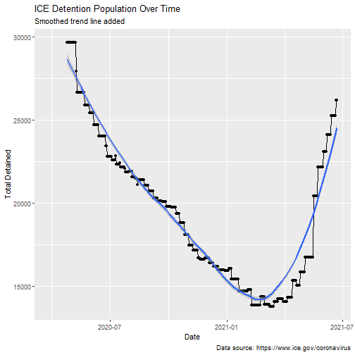
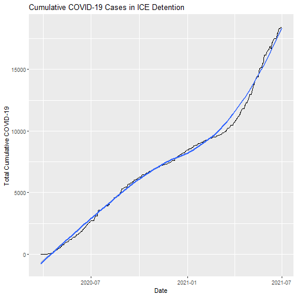

# Introduction

This document provides plots of data reported on the Immigration and Customs Enforcement [Guidance on COVID-19](https://www.ice.gov/coronavirus) website. On Friday March 13, 2020 ICE suspended family and social visitation. On March 27, 2020 ICE [established](https://web.archive.org/web/20200327175825/https://www.ice.gov/coronavirus) the Guidance on COVID-19 web page and indicated the site would be updated frequently. Shortly afterwards I began logging the data on a daily basis, occasionally relying on the Internet Archive's Wayback Machine's [regular scrapes](https://web.archive.org/web/20200401000000*/https://www.ice.gov/coronavirus) of the page to pick up days that I missed.


```r
# Load Libraries
library(readr)
library(tidyverse)
library(lubridate)
library(ggplot2)
library(janitor)
library(knitr)
options(digits=3)
opts_chunk$set(results = 'asis',
               comment = NA,
               prompt = FALSE,
               cache = FALSE)
# Turn off scientific notation
options(digits=5, scipen=15)
```


```r
# Load Dataset
df_summary <- read_csv("./../data/covid_summaries.csv", 
    col_types = cols(Date = col_date(format = "%m/%d/%Y"), 
        `Total Deaths` = col_double(), `Total COVID-19 Confirmed in Custody` = col_double())) %>% 
  clean_names()
```


```r
# ICE Detention Population Over Time
ggplot(df_summary, aes(x=date, y=total_detained))+
  geom_line()+
  geom_point()+
  geom_smooth()+
  labs(
    title = "ICE Detention Population Over Time",
    subtitle = "Smoothed trend line added",
    caption = "Data source: https://www.ice.gov/coronavirus",
    x = "Date",
    y = "Total Detained"
  )
```




```r
b_inaug <- df_summary %>% 
  filter(date == "2021-01-20") %>% 
  pluck("total_detained")

lowest <- df_summary %>% 
  filter(date == "2021-03-09") %>% 
  pluck("total_detained")

yesterday <- df_summary %>% 
  filter(date == Sys.Date()-1) %>% 
  pluck("total_detained")

detention_change <- yesterday - lowest

percent_change <- round((lowest/yesterday)*100,0)
```


When Biden took office, the detained population was 14715. The lowest detention population was 13764reported by ICE between March 9-15, which was 2021 just under three months into the Biden administration. However, by March 16 the detained population began rising again. Today it is 24100 which represents an increase of 10336 individuals from the lowest point and a 57% change from that value.


```r
# Total Confirmed COVID-19 Over Time
ggplot(df_summary, aes(x=date, y=total_covid_19_confirmed_in_custody))+
  geom_line()+
  geom_smooth()+
   labs(
    title = "Total Number of Confirmed COVID-19 Cases in ICE Detention",
    subtitle = "Smoothed trend line added",
    caption = "Data source: https://www.ice.gov/coronavirus",
    x = "Date",
    y = "Total COVID-19 Confirmed in Custody"
  )
```


```r
# Ratio Confirmed by Total Detained
df_summary %>% 
  mutate(`Confirmed Detained Ratio` = total_covid_19_confirmed_in_custody/total_detained) %>%
  ggplot(aes(x=date, y=`Confirmed Detained Ratio`))+
  geom_line()+
  geom_smooth()+
   labs(
    title = "Ratio of Confirmed COVID-19 Cases in ICE Detention by \nTotal ICE Detention Population",
    subtitle = "Smoothed trend line added",
    caption = "Data source: https://www.ice.gov/coronavirus"
  )
```


```r
# Cumulative COVID-19
ggplot(df_summary, aes(x=date, y=total_cumulative_covid_19))+
  geom_line()+
  geom_smooth()+
   labs(
    title = "Cumulative COVID-19 Cases in ICE Detention",
    subtitle = "Smoothed trend line added",
    caption = "Data source: https://www.ice.gov/coronavirus",
    x = "Date",
    y = "Total Cumulative COVID-19"
  )
```




```r
# Total COVID-19 Tests
ggplot(df_summary, aes(x=date, y=total_tested))+
  geom_line()+
  geom_smooth()+
   labs(
    title = "Total Number of COVID-19 Tests in ICE Detention Population \nOver Time",
    subtitle = "Smoothed trend line added",
    caption = "Data source: https://www.ice.gov/coronavirus",
    x = "Date",
    y = "Total Tested"
  )
```


```r
df_summary %>%
  mutate(normalized = total_tested/total_detained) %>% 
  ggplot(aes(x = date, y = `normalized`))+
  geom_line()+
  geom_smooth()+
  labs(title = "Ratio Total Tested/Total Detained",
       subtitle = "Smoothed trend line added",
       caption = "Data source: https://www.ice.gov/coronavirus",
       x = "Date",
       y = "Total Tested/Total Detained")
```


```r
# Total Deaths in ICE Custody
ggplot(df_summary, aes(x=date, y=total_deaths))+
  geom_line()+
  geom_smooth()+
   labs(
    title = "Total Number of Deaths in ICE Detention Over Time",
    subtitle = "Smoothed trend line added",
    caption = "Data source: https://www.ice.gov/coronavirus",
    x= "Date",
    y = "Total Deaths"
  )
```


