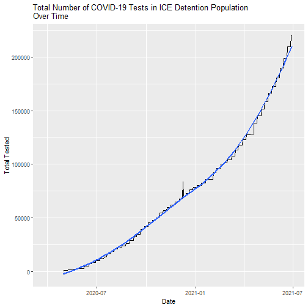
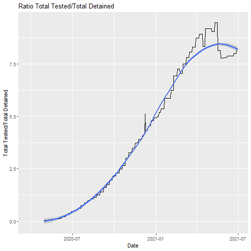

# Introduction

This document provides plots of data reported on the Immigration and Customs Enforcement [Guidance on COVID-19](https://www.ice.gov/coronavirus) website. On Friday March 13, 2020 ICE suspended family and social visitation. On March 27, 2020 ICE [established](https://web.archive.org/web/20200327175825/https://www.ice.gov/coronavirus) the Guidance on COVID-19 web page and indicated the site would be updated frequently. Shortly afterwards I began logging the data on a daily basis, occasionally relying on the Internet Archive's Wayback Machine's [regular scrapes](https://web.archive.org/web/20200401000000*/https://www.ice.gov/coronavirus) of the page to pick up days that I missed.

Results of those scrapes are contained in a [github](https://github.com/n8craig/ICE-COVID-19) repository, and additional details reported on my [website.](https://ncraig.netlify.app/)


```
Error in path.expand(path): invalid 'path' argument
```


When Biden took office, the detained population was 14715. The lowest detention population was 13764 reported by ICE between March 9-15, 2021  which was just under three months into the Biden administration. However, by March 16 the detained population began rising again. As of June 24, 2021, it is 26197 which represents an increase of 12433 individuals from the lowest point and a 90% change from that value.


# Active COVID-19 Cases in ICE Detention

```
Error in path.expand(path): invalid 'path' argument
```

# Cumulative COVID-19 Cases in ICE Detention


# Total Number of COVID-19 tests in ICE detention
Note there is no appreciable increase in the rate of tests after January 20, 2021 when Biden was inaugurated. Based on data reported by ICE, the Biden administration does not appear to have accelerated the rate of COVID-19 testing in ICE detention.






# Number of Deaths in ICE Detention


